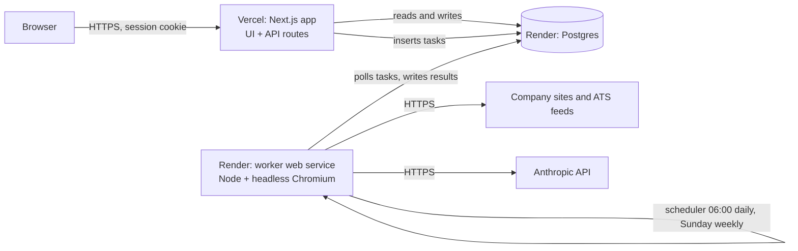
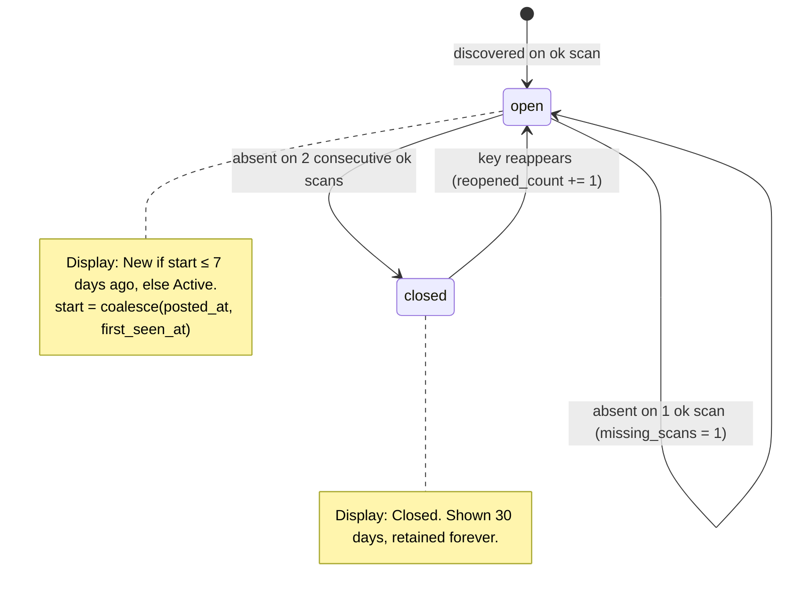

# Christopher — Careers Page Monitor

**Specification v0.1 (draft for review)** · 2026-09-04 · Single-user tool

Christopher watches the careers pages of companies you list, once a day. It records which roles appeared and which disappeared, keeps only roles that match your keywords, and shows them in a table where you decide *apply* or *skip* with a reason. Those reasons train a preference model that ranks future roles and proposes changes to your filters. It also recommends companies similar to the ones you already track.

This document is written to be implemented from directly (by you or by Claude Code). Sections 3 to 7 are normative; section 9 is the acceptance bar.

---

## Contents

1. [Decisions you should know about before reading further](#1-decisions-you-should-know-about-before-reading-further)
2. [Goals and non-goals](#2-goals-and-non-goals)
3. [Functional requirements](#3-functional-requirements)
   - 3.1 Company list
   - 3.2 Careers source discovery (homepage → careers page)
   - 3.3 Daily scan and job extraction
   - 3.4 Change detection, statuses, "live for"
   - 3.5 Keyword gate
   - 3.6 Decisions, reasons, and learning
   - 3.7 The interactive table and other screens
   - 3.8 Similar-company recommendations
   - 3.9 Health and attention panel
   - 3.10 Settings
4. [AI engine: call sites, models, guardrails](#4-ai-engine-call-sites-models-guardrails)
5. [Data model](#5-data-model)
6. [Architecture and hosting (Vercel + Render)](#6-architecture-and-hosting-vercel--render)
7. [Scraping policy and robustness](#7-scraping-policy-and-robustness)
8. [Tech stack](#8-tech-stack)
9. [Quality bar and test plan](#9-quality-bar-and-test-plan)
10. [Running cost](#10-running-cost)
11. [Delivery plan](#11-delivery-plan)
12. [Open questions for you](#12-open-questions-for-you)
- Appendix A: ATS fingerprints and endpoints
- Appendix B: Status state machine
- Appendix C: Example preference profile
- Appendix D: Requirements traceability

---

## 1. Decisions you should know about before reading further

These are the places where the literal request cannot be delivered as stated, or where there is a real design choice. Each has a recommendation; the rest of the document assumes it.

**1. "How long it has been live" is only partly knowable.** A careers page rarely states when a role was posted. Applicant tracking systems (ATSs) with public JSON feeds often do (Greenhouse, Lever, Ashby, Workday and others expose a published/created timestamp). For plain HTML pages the only honest number is *how long since this tool first saw it*. The table therefore shows `live for` computed from the ATS posted date when available, otherwise from first-seen, and marks which one it is. Roles found on the very first scan of a newly added company are flagged as *seeded* so a day-one "12 roles, all new" does not mislead you.

**2. Keywords and learning pull in opposite directions; the spec resolves this explicitly.** You asked for the table to contain only keyword-matched roles, and for the AI to use your reasons to inform which roles are included in future. Learning cannot add roles the keyword gate has already removed unless there is a channel for it. The design:
- The keyword gate stays a hard, user-controlled filter on what is in the main table.
- Within the table, every role gets a fit score (0–100) and a one-line rationale from the preference model. Low scorers can be auto-collapsed once you turn that on; nothing is silently deleted.
- The model *proposes* keyword and filter changes with evidence; you accept or reject them.
- A separate, clearly labelled section, "Outside your keywords", shows up to ten new roles per day that failed the gate but score highly. This is the one place the spec goes beyond the literal request. It is a setting, on by default, because it is the mechanism that lets learning widen your search rather than only narrow it. Turn it off and the behaviour is exactly what you asked for.

**3. Prefer ATS APIs to HTML scraping; scrape HTML only as a fallback.** Most careers pages are hosted on or embed one of roughly a dozen ATS platforms, and those platforms publish JSON feeds intended for job boards. Detecting the ATS and reading its feed is far more reliable than parsing HTML and gives you IDs, locations, departments, posted dates and full descriptions for free. This is where most of the "search accurately" sophistication lives. HTML extraction (with a self-healing selector recipe, see 3.3) is the fallback for the remainder.

**4. Discovery is automatic but confirmed once when unsure.** From a homepage URL the system will usually find the careers source on its own. When its confidence is below a threshold it shows you its best candidates with a preview of the roles it found there, and you click one (or paste a URL). A five-second confirmation per company beats a silently wrong source that reports nothing for months. Sources that stop working trigger re-discovery automatically.

**5. "Closed" is inferred, so it is inferred conservatively.** A role disappearing from a page might be a scrape failure. A role is marked closed only after it is absent from two consecutive *successful* scans, and a scan whose result looks broken (fetch error, zero roles where there were many) never closes anything.

**6. Learning is a maintained profile plus retrieval, not fine-tuning.** For one user with tens to hundreds of decisions, the right mechanism is a versioned, human-readable preference profile synthesised from your decisions and reasons, fed to the model as context when it scores each new role, together with a digest of your past decisions. You can read and edit the profile. It is auditable, cheap, and improves from the first decision.

**7. Company recommendations must be verified before you see them.** Language models propose plausible-sounding companies that do not exist or are mis-described. Every suggestion is checked deterministically (homepage resolves, a careers source is discoverable, open roles counted) before it is shown.

**8. Hosting: UI on Vercel, worker and database on Render.** Vercel runs the Next.js interface. A single always-on Render web service runs the scheduler, the scrapers (with headless Chromium) and all AI calls, and Render hosts Postgres. The only integration point between the two platforms is the database; the UI never calls the worker directly, it enqueues tasks in a table. If cross-platform database access proves irritating, moving the UI to a second Render service is a one-afternoon change with no code impact. Cost is roughly $14/month for Render plus API usage (section 10).

---

## 2. Goals and non-goals

### Goals

- Add a company by pasting its homepage URL; the system finds and verifies its careers source.
- Scan every active company once a day; detect new and removed roles.
- Show keyword-matched roles in a table with: company, website, role, link to the description, live-for, status (New / Active / Closed).
- Let you record apply/skip with a reason on each role, quickly (keyboard-first).
- Learn from decisions and reasons: rank roles, suggest filter changes, surface near-misses.
- Recommend companies very similar to the ones you track, verified to be real and hiring.
- Be reliable and quiet: no false "closed", no duplicate rows, failures surfaced in one place.

### Non-goals (v1)

- Multiple users, sharing, or public access.
- Applying on your behalf, CV tailoring, cover letters.
- Aggregator sources (LinkedIn, Indeed, Otta). Company pages only.
- Email or push notifications (natural v2; the "New" filter is the daily inbox).
- Historical backfill of roles posted before a company was added.
- Solving CAPTCHAs or evading bot protection. Blocked sources are reported, not fought.

---

## 3. Functional requirements

Requirement IDs (R-x.y) are referenced by the test plan.

### 3.1 Company list

- **R-1.1** Add a company by homepage URL. Name is derived from the page title / `og:site_name` and editable. Favicon fetched for display.
- **R-1.2** Company states: `active` (scanned daily), `paused` (kept, not scanned), `archived` (hidden, data retained).
- **R-1.3** A company can have more than one careers source (e.g. a Greenhouse board plus a separate internships page). Scans union them.
- **R-1.4** Bulk add by pasting a list of URLs (one per line). Each is discovered independently.
- **R-1.5** Deleting a company requires confirmation and cascades to its jobs, decisions remain in the learning corpus (anonymised to title/company name).

### 3.2 Careers source discovery (homepage → careers page)

Input: a homepage URL. Output: zero or more `career_sources` with a type, URL, confidence and a preview of roles found. Runs as a worker task; the UI shows progress and the result within about a minute.

Pipeline, in order. Every step adds candidates with a confidence; the best candidate decides the outcome.

1. **Normalise and fetch the homepage.** Follow redirects, record the canonical domain. Fetch with plain HTTP first; if the page has very little text or few links (a JavaScript shell), re-fetch with headless Chromium.
2. **Harvest and score links.** Collect every anchor on the homepage (header and footer especially). Score by anchor text against a careers vocabulary (careers, jobs, join us, join the team, work with us, we're hiring, open roles, open positions, vacancies, opportunities, life at …, plus common non-English equivalents: Karriere, Jobs, Carrières, Empleo, Trabaja con nosotros, Vacatures, Lavora con noi), by path (`/careers`, `/jobs`, `/join`, `/join-us`, `/work-with-us`, `/company/careers`, `/about/careers`, `/vacancies`, `/opportunities`, with optional locale prefix) and by ATS hostnames (Appendix A).
3. **Probe well-known paths** on the same domain and the subdomains `careers.`, `jobs.`, `join.`. Treat soft-404s (200 with "not found" in title/body) as misses.
4. **Read robots.txt and sitemaps** for career-like URLs and job-detail URL patterns (capped at 2,000 sitemap entries).
5. **Fingerprint the ATS.** Across everything fetched, look for links, iframes and scripts that reveal an ATS and its account slug (Appendix A). A slug *discovered on the company's own pages* is strong evidence. A slug *guessed from the domain name* (e.g. `acme` from `acme.com`) is weak evidence and always requires confirmation, because slugs collide.
6. **Verify structured sources** by calling the ATS feed. Success means HTTP 200, parseable, and (where the feed exposes it) a company name that fuzzy-matches the homepage title.
7. **Classify candidate pages.** For the top five same-domain candidates decide whether each is a job *listing* (has job-detail links, JSON-LD `JobPosting`, or an embedded ATS), a *landing* page that links onward (follow one more hop), or neither. Heuristics first; the model (call site A2) only when heuristics are inconclusive.
8. **Score and decide.**

| Evidence | Confidence |
|---|---|
| ATS feed verified, slug discovered on company pages, name matches or feed has ≥1 role | 0.95 |
| ATS feed verified, slug guessed from domain | 0.70 |
| Same-domain page with JSON-LD `JobPosting` or ≥3 job-detail links | 0.85 |
| Same-domain page reached via careers-vocabulary link, model says listing | 0.75 |
| Careers landing page found, no listing reached within one hop | 0.50 |
| Nothing found | 0 |

- **R-2.1** Confidence ≥ 0.85: accept automatically, badge the source "auto-detected", run the first scan.
- **R-2.2** 0.50 ≤ confidence < 0.85: mark `needs_confirmation`. UI shows up to three candidates, each with URL, detected type and three sample role titles. One click confirms.
- **R-2.3** Confidence < 0.50: UI says it could not find the careers page and asks for a URL. Any pasted URL (including a bare ATS board URL) is run through steps 5 to 7.
- **R-2.4** Every discovery run stores its candidate list and log for debugging.
- **R-2.5** Re-discovery is triggered automatically after 3 consecutive failed scans, after a scan that returns zero roles where the previous successful scan had ≥3, or manually. If re-discovery finds a different high-confidence source (typical when a company migrates ATS), it is proposed for confirmation, not swapped silently.
- **R-2.6** Target: ≥80% of companies in the golden set (section 9) resolve automatically at ≥0.85 with the correct source; zero cases of a wrong source accepted automatically.

### 3.3 Daily scan and job extraction

- **R-3.1** A daily run starts at the configured local time (default 06:00) and enqueues one `scan_company` task per active company. Tasks execute with concurrency 4 across distinct domains, one request per 2 seconds per domain, a 3-minute budget per company, one retry on transient failure. A run for one company never blocks another.
- **R-3.2** Each source type has an adapter that returns normalised postings: `external_id?, title, url, location?, department?, employment_type?, remote?, posted_at?, updated_at?, description?, salary_text?`.
- **R-3.3** Adapter tiers:
  - *Tier 1, structured JSON/XML feeds (v1)*: Greenhouse, Lever, Ashby, Workable, SmartRecruiters, Recruitee, Personio, BambooHR, Workday, Pinpoint, Breezy; plus generic JSON-LD `JobPosting` and RSS/Atom feeds.
  - *Tier 2, HTML with known structure (v1.x)*: Teamtailor, iCIMS, Jobvite, JazzHR, Rippling, SAP SuccessFactors, Oracle Cloud HCM/Taleo, Eightfold, Phenom, Welcome to the Jungle.
  - *Tier 3, generic HTML via model extraction (v1)*: anything else.
- **R-3.4** Tier 3 extraction: render with headless Chromium (dismiss cookie banners with a list of common selectors, scroll to bottom, click "load more" up to 10 times, follow pagination up to 20 pages). Prefer embedded structure first (JSON-LD, `__NEXT_DATA__`, inline JSON). Otherwise build a compact representation of the page (each anchor's text, href and nearby text) and ask the model (A3) for the list of postings **and a selector recipe** (`list_item`, `title`, `link`, `location` selectors).
- **R-3.5** Self-healing recipes. The recipe is validated against the same page (must reproduce ≥90% of the model's postings) and stored on the source. Subsequent scans run the recipe deterministically at zero AI cost. If the recipe yields zero postings or fails validation, and the page content hash has changed, the model is called again and the recipe replaced. Pages whose content hash is unchanged since the last scan skip extraction entirely.
- **R-3.6** Anti-hallucination validation of model extraction: every returned URL must be present in the harvested anchor set; every title must appear in page text (fuzzy ≥0.9). Violators are dropped; if more than 20% violate, the scan is marked `partial`.
- **R-3.7** Job description snapshot. For postings that pass the keyword gate (and near-miss candidates), store the description text (from the feed when the ATS supplies it; otherwise fetch the detail page and extract the main content). Cap 30k characters. Re-fetch when the source's `updated_at` changes or every 14 days. This keeps the description readable after the role closes and the link dies.
- **R-3.8** Scan outcome: `ok`, `partial` (some postings dropped by validation, or count fell >70% from the previous ok scan), `suspect_empty` (zero postings where the previous ok scan had ≥3), `failed` (fetch error, HTTP ≥400, bot-protection challenge, parser exception). Only `ok` scans may close roles (3.4).
- **R-3.9** Cap 500 postings per source per scan. Store the last 3 raw responses (compressed) per source for debugging.
- **R-3.10** Manual "Rescan now" per company and "Run daily scan now" globally.

### 3.4 Change detection, statuses, "live for"

- **R-4.1** Job identity key, per source: the ATS `external_id` when present; otherwise the normalised URL (lowercase host, strip fragment, strip tracking parameters such as `utm_*`, `gh_src`, `lever-source`, `source`, `ref`, strip trailing slash); otherwise a hash of normalised title + location.
- **R-4.2** On an `ok` scan: new key → insert job (`first_seen_at = now`, `posted_at` from the feed if present, `status = open`); existing key → update `last_seen_at`, refresh changed fields, log an `updated` event if title, location or description changed; open job absent → `missing_scans += 1`; when `missing_scans` reaches 2 → `status = closed`, `closed_at = last_seen_at`.
- **R-4.3** A closed job whose key reappears is reopened (`reopened_count += 1`, event logged). A new posting whose normalised title and location match a job at the same company closed within 30 days is linked as `repost_of` (informational).
- **R-4.4** Display status is derived: **New** = open and `coalesce(posted_at, first_seen_at)` within the last 7 days; **Active** = open and older; **Closed** = closed. Closed roles are shown for 30 days by default and retained indefinitely.
- **R-4.5** `live for` = today − `coalesce(posted_at, first_seen_at)` while open, or `closed_at` − that start once closed. The UI marks values derived from first-seen with a small indicator and a tooltip ("Source does not publish a posted date; counted from when this tool first saw the role").
- **R-4.6** Postings found on a company's first successful scan are flagged `seeded`. They still show as New for 7 days (they are new to you) but carry the seeded marker.
- **R-4.7** Scans that are not `ok` never change `missing_scans` or close anything.
- **R-4.8** Roles that are identical in title at the same company but differ in location (common on Greenhouse) remain separate rows; the table offers "group by role" which merges them into one expandable row, and a decision on the group applies to all members.

### 3.5 Keyword gate

- **R-5.1** Settings: `include_keywords` (default `["operations"]`), `exclude_keywords` (default empty), `match_fields` (default title; optional department, description), `location_filter` (optional list of allowed location substrings or countries, plus an include-remote flag).
- **R-5.2** Matching is case-insensitive and word-boundary aware; a quoted phrase matches exactly; a trailing `*` matches a prefix (`operat*`). Any exclude match wins. Description matching uses text the feed already supplies; for HTML sources it is title and department only unless enabled per company (it requires a detail fetch per posting).
- **R-5.3** Every posting from every scan is stored regardless of the gate. Only postings with `in_table = matched AND NOT excluded AND location_ok` appear in the main table. Storing everything is what makes keyword changes retroactive and near-miss surfacing possible.
- **R-5.4** Changing keywords re-evaluates all open roles and roles closed in the last 30 days immediately; the table reflects the new gate without waiting for the next scan.
- **R-5.5** The matched terms are stored per job and shown in the row (e.g. a chip "operations").

### 3.6 Decisions, reasons, and learning

- **R-6.1** On any role you can set `apply` or `skip`. A reason is required for `skip` and encouraged for `apply` (the UI nudges: "one line on why helps the ranking"). Decisions can be changed; the previous one is kept as superseded.
- **R-6.2** Reason tagging (A6). After saving, the model maps the free-text reason onto a controlled, growing tag vocabulary, e.g. `seniority:too_junior`, `seniority:too_senior`, `location:not_commutable`, `location:wrong_country`, `domain:uninterested`, `domain:interested`, `role_type:not_operations`, `company:stage`, `company:sector`, `comp:too_low`, `title:mismatch`, `timing`, `already_applied`. Tags are shown and editable. New tags proposed by the model are added to the vocabulary once you have accepted them.
- **R-6.3** Seed profile. At setup you write a few sentences about what you are looking for (seniority, sectors, locations, compensation floor, deal-breakers). This is the starting point for the preference profile and is never overwritten.
- **R-6.4** Preference profile (A7). A versioned markdown document synthesised by the model from the seed profile, all decisions with reasons and tags, and the current keywords. Regenerated when five or more new decisions have accumulated since the last version, or weekly. Sections: target roles; seniority band; locations; sectors and companies preferred and avoided; deal-breakers; positive signals; open questions. Statements you edit or add are *pinned* and must be preserved verbatim by later syntheses. Every version is kept and diffable.
- **R-6.5** Open questions. When the synthesiser is unsure how to generalise (for example, two skipped logistics roles: the sector, or those two companies?), it writes a question. Questions appear on the Learning page; your answer becomes a pinned statement.
- **R-6.6** Fit scoring (A5). Each role entering the table (and each near-miss candidate) is scored 0–100 with a verdict (`strong` / `possible` / `unlikely`) and a rationale of at most two sentences, using the current profile, a compact digest of your last 100 decisions, and the role's title, company, location, department and description excerpt. Roles are re-scored when a new profile version is published.
- **R-6.7** Use of the score: default sort is status (New first) then score descending; the rationale shows on hover or row expand. An optional hide threshold (default off) collapses roles under the threshold into "Hidden by your preferences (n)"; expanding and deciding on a hidden role is itself a decision and feeds learning.
- **R-6.8** Calibration. After 20 decisions the Learning page shows agreement: the apply rate among roles scored ≥70 and the skip rate among roles scored <30, with counts. Disagreements are fed to the next profile synthesis as explicit cases to reconcile. Target after 50 decisions: ≥75% agreement in both buckets. This is a hypothesis to measure, not a guarantee.
- **R-6.9** Filter suggestions (A8). Weekly, the model reviews decisions and near-miss outcomes and proposes changes: add an include keyword, add an exclude keyword, add or change a location filter, pause a company, enable the hide threshold. Each carries evidence (the decisions that support it). Accept applies it; reject suppresses that suggestion for 60 days.
- **R-6.10** Near-miss surfacing (setting `near_miss_enabled`, default on). New postings that fail the keyword gate are scored on title, department and location only. Those scoring ≥70 appear in a separate section "Outside your keywords", capped at 10 per day, ranked by score. Decisions there count like any other and are strong evidence for keyword suggestions.
- **R-6.11** Every AI call is logged with tokens and cost; a monthly budget setting stops non-essential calls (near-miss scoring first, then suggestions) when exceeded, and the UI says so.

### 3.7 The interactive table and other screens

**Roles table (home).** Columns: Company (favicon + name), Website (link icon), Role (title, linking to the live description in a new tab), Location, Live for (e.g. `3d`, `6w`, with the first-seen marker), Status chip (New / Active / Closed), Fit (score; rationale on hover), Decision (Apply / Skip; opens a reason field), Reason (truncated, click to edit), Source badge (Greenhouse, Lever, HTML …). Row expand shows the stored description, matched keywords, tags, scan history and events.

- **R-7.1** Filters: status (multi), company, decision state (undecided / apply / skip), minimum fit, show hidden, show closed, free-text search. Sorting on every column. Filter state persists in the URL.
- **R-7.2** Keyboard: `j`/`k` move, `a` apply, `s` skip (focus reason), `enter` save, `o` open description, `g` toggle group-by-role. Multi-select with `x`; bulk skip with one reason.
- **R-7.3** Header banner: last run time and outcome ("Today 06:03 · 28 of 30 companies OK · 4 new roles"), linking to the Health panel when anything failed.
- **R-7.4** Sections below the table: "Outside your keywords" (3.6) and "Hidden by your preferences" (collapsed).
- **R-7.5** CSV export of the current filtered view.

**Companies.** List with source type, confidence badge, last scan status, open/matched role counts, actions (rescan, re-discover, edit source URL, pause, archive). Company detail shows sources, scan history with outcomes and durations, and all roles including closed.

**Suggestions.** Similar-company recommendations (3.8) with accept / reject-with-reason.

**Learning.** Current profile (editable, pinned statements highlighted), version history, open questions, calibration numbers, pending filter suggestions.

**Health.** Failed and suspect scans, sources needing confirmation, blocked sources, re-discovery proposals, AI spend this month.

**Settings.** Keywords, location filter, hide threshold, near-miss toggle, daily run time and timezone, seed profile text, monthly AI budget, password change.

### 3.8 Similar-company recommendations

- **R-8.1** Company profiling (A9). When a company is added (and quarterly), fetch its homepage and about page and produce a profile: one-liner, sector, sub-sector, business model, customer type, stage, size band, HQ country, operating geographies, tags. Stored and shown on the company detail page.
- **R-8.2** Candidate generation (A10). Weekly (Sunday) and on demand, the model is given the portfolio of profiles, your preference profile, and previously rejected suggestions with reasons, and asked for 15 candidates, each with a homepage URL, the listed companies it most resembles, and why. The call uses the server-side web search tool so that each candidate is grounded in a search result rather than recalled from memory.
- **R-8.3** Verification (deterministic, mandatory). Homepage resolves (HTTP 200, not a parked or for-sale page); domain not already in your list and not rejected within 180 days; the discovery pipeline in probe mode finds a careers source; open roles are counted; keyword-matching roles are counted. Candidates that fail the first three checks are discarded before you see them.
- **R-8.4** Presentation. Up to 10 suggestions per week, ranked by similarity confidence, then number of currently matching roles. Each shows: name, one-liner, "similar to" chips, open roles, matching roles, rationale. Accept adds the company (with its already-discovered source) and runs the first scan. Reject requires a reason, which feeds the preference profile (for example "no agencies", "not fintech").
- **R-8.5** A suggestion is never shown twice unless it was expired unseen for 90 days.

### 3.9 Health and attention panel

- **R-9.1** Anything that needs you appears here and nowhere else: sources needing confirmation, three consecutive failures, suspect empties, blocked sources, re-discovery proposals, AI budget exceeded, companies with no source.
- **R-9.2** Each item has a one-click resolution path (confirm candidate, paste URL, pause company, dismiss).

### 3.10 Settings

Listed in 3.7. All settings live in one `settings` table as key/value JSON and are editable without redeploying.

---

## 4. AI engine: call sites, models, guardrails

All calls go through the Anthropic Messages API using the official TypeScript SDK (`@anthropic-ai/sdk`). Default model for every call site is `claude-opus-5`. Structured outputs (`output_config.format` with a Zod schema via `zodOutputFormat`) are used everywhere a schema is listed, so responses are validated before use. Adaptive thinking is left on; `output_config.effort` is set per call site. Prompt caching is applied to the stable prefix (instructions, profile, decision digest) so the per-role suffix is the only uncached input. The server-side refusal fallback is enabled so a safety-classifier refusal on scraped content degrades to another model rather than failing the scan.

| ID | Call site | Trigger | Input | Output (schema) | Effort | Typical tokens (in / out) |
|---|---|---|---|---|---|---|
| A1 | Careers link disambiguation | Discovery, when heuristics tie or are weak | Company name; up to 300 harvested links (text, href) | `{candidates: [{url, confidence, reason}]}` | low | 3k / 0.2k |
| A2 | Listing-page classification | Discovery, inconclusive heuristics | Page text excerpt; link pattern summary | `{kind: listing\|landing\|other, next_hop_url?, confidence}` | low | 4k / 0.1k |
| A3 | HTML posting extraction + selector recipe | Tier-3 scan, content hash changed and no valid recipe | Compact DOM (anchors + surrounding text), ≤20k tokens | `{postings: [{title, url, location?, department?}], recipe: {...}, confidence}` | low | 15k / 2k |
| A4 | Description clean-up (only when heuristic extraction is poor) | Detail fetch | Raw page text | `{description_text, salary_text?, employment_type?, remote?}` | low | 5k / 1.5k |
| A5 | Fit scoring | Role enters table; near-miss candidate; profile version change | Cached: instructions + profile + last-100-decision digest. Uncached: role fields + description excerpt (≤1.5k tokens) | `{score, verdict, rationale, flags[]}` | low | 3k cached + 1.5k / 0.15k |
| A6 | Reason tagging | Decision saved | Reason text, role summary, tag vocabulary | `{tags[], proposed_new_tags[]}` | low | 1k / 0.1k |
| A7 | Profile synthesis | ≥5 new decisions or weekly | Seed profile, pinned statements, all decisions (title, company, location, department, snippet, decision, reason, tags), current profile, calibration disagreements | Markdown profile + `{open_questions[]}` | high | 10k / 2k |
| A8 | Filter suggestions | Weekly | Decisions, near-miss outcomes, current filters, past rejected suggestions | `{suggestions: [{type, value, evidence[]}]}` | high | 6k / 0.5k |
| A9 | Company profiling | Company added; quarterly | Homepage + about text (≤6k tokens) | Company profile schema | low | 6k / 0.3k |
| A10 | Similar-company generation | Weekly; on demand | Portfolio profiles, preference profile, rejected suggestions; tool `web_search_20260209` (max 15 uses) | `{candidates: [{name, homepage_url, similar_to[], rationale, confidence}]}` | high | 8k / 2k + searches |

Guardrails common to all call sites:

- Outputs are schema-validated; anything else is discarded and the pipeline falls back (heuristic extraction, unscored role, no suggestion) rather than failing the run.
- Extraction outputs (A3) must reference only URLs and titles present on the page (R-3.6).
- Scores are clamped; tags must come from the vocabulary or be explicitly proposed.
- Scraped page content is untrusted. It is placed in the user turn, clearly delimited, with an instruction that it is data; nothing in it can change the task. No tool that acts on the world is exposed to A3/A4.
- Every call writes an `ai_calls` row (call site, model, tokens, cache reads, cost, duration, outcome). The Health panel shows month-to-date spend against the budget setting.
- Model choice is a setting per call site, defaulting to `claude-opus-5`. Swapping bulk sites (A3, A5, A6) to a cheaper model is your decision to make once you have seen real costs; the spec does not pre-empt it.

Why not an agent framework: the pipeline is a deterministic workflow with classification and extraction steps. Each step has one input and one schema-checked output, which is testable and cheap. Open-ended browsing agents are harder to test and their failures are quieter.

---

## 5. Data model

Postgres. Names are indicative; the ORM schema is the source of truth once written.

```
companies            id, name, homepage_url, domain (unique), favicon_url, status [active|paused|archived],
                     notes, added_at, archived_at

career_sources       id, company_id, type [greenhouse|lever|ashby|workable|smartrecruiters|recruitee|
                     personio|bamboohr|workday|pinpoint|breezy|jsonld|rss|html], url, api_url,
                     ats_slug, ats_site, discovery_method, confidence, confirmed_by_user bool,
                     recipe jsonb, content_hash, status [active|needs_confirmation|failing|blocked|disabled],
                     consecutive_failures int, last_ok_scan_at, created_at, verified_at

discovery_runs       id, company_id, started_at, finished_at, status, candidates jsonb, chosen_source_id, log jsonb

scan_runs            id, started_at, finished_at, companies_total, companies_ok, companies_failed,
                     new_roles, closed_roles, trigger [schedule|manual]

scans                id, scan_run_id, source_id, started_at, finished_at,
                     status [ok|partial|suspect_empty|failed], fetch_method [api|http|browser],
                     postings_found, new_count, closed_count, error, duration_ms, raw_snapshot_ref

jobs                 id, company_id, source_id, external_key (unique per source), title, normalized_title,
                     url, location, department, employment_type, remote bool, salary_text,
                     posted_at, first_seen_at, last_seen_at, closed_at, status [open|closed],
                     missing_scans int, seeded bool, reopened_count int, repost_of_job_id,
                     description_text, description_hash, description_fetched_at,
                     keyword_matched bool, keyword_terms text[], location_ok bool, in_table bool, near_miss bool,
                     fit_score int, fit_verdict, fit_rationale, fit_profile_version, fit_scored_at,
                     created_at, updated_at

job_events           id, job_id, type [discovered|updated|closed|reopened|scored|decided|hidden|unhidden],
                     payload jsonb, at

decisions            id, job_id, decision [apply|skip], reason, tags text[], superseded bool, created_at
                     -- exactly one non-superseded row per job

tag_vocabulary       tag (pk), description, created_by [seed|model|user], accepted bool

preference_profiles  id, version, markdown, pinned_statements text[], open_questions jsonb,
                     source_decision_count, generated_at, model

filter_suggestions   id, type [keyword_include|keyword_exclude|location|pause_company|hide_threshold],
                     value jsonb, evidence jsonb, status [pending|accepted|rejected], created_at, resolved_at

company_profiles     id, company_id (nullable for suggestions), name, domain, one_liner, sector, sub_sector,
                     business_model, customer_type, stage, size_band, hq_country, geographies text[],
                     tags text[], raw jsonb, generated_at

company_suggestions  id, name, homepage_url, domain (unique), profile_id, rationale, similar_to uuid[],
                     verification jsonb {homepage_ok, careers_source_id, open_roles, matching_roles},
                     rank, status [pending|accepted|rejected|expired], rejection_reason, created_at, resolved_at

settings             key (pk), value jsonb, updated_at

tasks                id, type [discover|scan_company|fetch_description|score_job|tag_reason|synthesize_profile|
                     suggest_filters|profile_company|suggest_companies|rescore_all],
                     payload jsonb, status [queued|running|done|failed], run_after, attempts,
                     locked_at, locked_by, error, created_at, finished_at

ai_calls             id, call_site, model, input_tokens, output_tokens, cache_read_tokens, cache_write_tokens,
                     cost_usd, duration_ms, ok bool, ref_type, ref_id, at
```

Indexes worth naming: `jobs(company_id, status)`, `jobs(in_table, status, fit_score)`, `jobs(source_id, external_key)` unique, `tasks(status, run_after)`, `decisions(job_id) where not superseded` unique.

---

## 6. Architecture and hosting (Vercel + Render)



**Vercel (apps/web).** Next.js, App Router. Server components read the database directly; API routes handle writes (decisions, settings, company CRUD) and enqueue tasks. Hobby plan is sufficient for personal use. No AI key on Vercel.

**Render (apps/worker).** One *web service* on the Starter instance (always on, roughly $7/month). It runs:
- an in-process scheduler (daily run, weekly suggestions and synthesis), idempotent against `scan_runs` so a restart during a run resumes rather than repeats;
- a task loop polling `tasks` every 5 seconds with `SELECT … FOR UPDATE SKIP LOCKED`, which is also how interactive flows (discover a newly added company, rescan now) execute within seconds;
- headless Chromium via Playwright, from the official Playwright Docker base image;
- all Anthropic API calls;
- `GET /healthz` as its only inbound route.

Why a web service rather than a Render Cron Job: the cron job type is cheaper but can only run on schedule, so on-demand discovery would need a second always-on process anyway, and Render's free web tier spins down when idle, which kills an in-process scheduler.

**Render Postgres.** Basic tier (roughly $6–7/month; the free tier expires after 30 days and must not be used). Enable external connections with TLS for Vercel; Vercel's egress IPs vary, so the safeguard is TLS plus a strong password rather than an IP allowlist. Connection pooling: each Vercel function uses a `pg` pool of at most 3; single-user traffic stays far below the instance connection limit. Enable Render's automated backups.

**Authentication.** Single user. A login page takes one password, checked against an Argon2 hash in an environment variable, and sets a signed, HttpOnly, SameSite=Lax cookie valid for 30 days. Next.js middleware protects every route and API. No user table, no OAuth. Rate-limit the login endpoint.

**Environment variables.** Web: `DATABASE_URL`, `SESSION_SECRET`, `APP_PASSWORD_HASH`. Worker: `DATABASE_URL`, `ANTHROPIC_API_KEY`, `TZ`, `SCRAPER_CONTACT_EMAIL`. Everything else is in `settings`.

**Deployment.** Vercel Git integration for the web app (root directory `apps/web`). A `render.yaml` blueprint defines the worker (Docker) and the database. Migrations run from the worker on start (Drizzle migrate), guarded by an advisory lock.

**Alternative, one line.** If cross-platform database access is a nuisance, run the Next.js app as a second Render web service; nothing in the code changes.

---

## 7. Scraping policy and robustness

- Identify honestly: user agent `ChristopherJobMonitor/1.0 (+mailto:<your address>)`.
- Respect `robots.txt` for HTML fetches by default, with a per-company override you can set knowingly. ATS feeds are public JSON published for job boards and are read directly.
- One request per 2 seconds per domain; one scan per day; conditional requests (ETag / If-Modified-Since) where honoured; content-hash short-circuit so unchanged pages cost nothing downstream.
- Browser fetches block images, fonts and media; 30-second navigation timeout; one retry.
- Bot protection (HTTP 403/429, challenge pages) marks the source `blocked` and puts it on the Health panel. The remedy is manual (usually pasting the underlying ATS URL, which is almost always unprotected). The tool never attempts to evade protection.
- Failures are isolated per company; the daily run completes and reports partial results.
- Snapshots: last 3 raw responses per source, compressed, for diagnosis and for replaying into tests.

---

## 8. Tech stack

TypeScript end to end, one language and one set of types across UI and worker.

| Layer | Choice | Reason |
|---|---|---|
| Repo | pnpm workspaces: `apps/web`, `apps/worker`, `packages/db`, `packages/core`, `packages/ai` | Shared schema and pure-function core, independently deployable apps |
| UI | Next.js (App Router), Tailwind, shadcn/ui, TanStack Table | Fast to build a dense, keyboard-driven table |
| Worker | Node 22, Playwright, Cheerio, undici, croner, `pg` | Headless browser plus lightweight HTML parsing |
| Database | Postgres, Drizzle ORM + migrations | Typed schema, simple migrations, no codegen step |
| AI | `@anthropic-ai/sdk`, Zod schemas with `zodOutputFormat`, prompt caching | Validated structured outputs, cached stable prefixes |
| Tests | Vitest; recorded ATS JSON and HTML fixtures; Playwright integration tests opt-in | Deterministic tests for adapters and diffing |
| Ops | `render.yaml`, Vercel project, Drizzle migrate on worker boot | Reproducible deploys |

`packages/core` (discovery heuristics, adapters, normalisation, diffing, keyword engine) is pure and has no I/O of its own; fetchers are injected. This is where most tests live.

A Python worker (Playwright + httpx + BeautifulSoup) would be equally capable; it is not recommended only because it makes two languages and two type systems for a one-person project.

---

## 9. Quality bar and test plan

**Golden set.** Before implementation you supply roughly 25 real companies (section 12). They are chosen to cover: at least eight ATS types, five custom HTML pages, two JavaScript-heavy pages, two multi-region enterprises on Workday, one careers landing page that hops to an external board, one bot-protected site. Their pages and feeds are recorded as fixtures and re-recorded monthly.

**Acceptance criteria**

| Area | Criterion | Requirement |
|---|---|---|
| Discovery | ≥80% of golden-set companies resolve automatically at ≥0.85 to the correct source | R-2.6 |
| Discovery | 0 wrong sources accepted automatically (a wrong source at ≥0.85 is a release blocker) | R-2.1 |
| Discovery | 100% resolved after at most one confirmation or one pasted URL | R-2.2, R-2.3 |
| Extraction | Recall ≥98% and precision ≥98% against a manual count for Tier-1 sources | R-3.3 |
| Extraction | Recall ≥90%, precision ≥98% for Tier-3 sources in the golden set | R-3.4 |
| Extraction | Recipes reproduce the model's extraction on the recorded page ≥90% and run at zero AI cost on unchanged pages | R-3.5 |
| Diffing | Property tests: a non-ok scan never closes a role; closing requires two consecutive ok scans; reopen restores state; identity survives tracking-parameter changes | R-4.2, R-4.7 |
| Keywords | Changing keywords updates `in_table` for all open roles within one request | R-5.4 |
| Learning | After 50 decisions, agreement ≥75% in both calibration buckets (measured, reported on the Learning page; hypothesis) | R-6.8 |
| Recommendations | Every displayed suggestion has a live homepage and a verified careers source | R-8.3 |
| Operations | A daily run of 50 companies finishes in under 15 minutes; one failure never blocks others; failures appear on the Health panel within the same run | R-3.1, R-9.1 |
| Security | Every page and API route returns 401 without a valid session; login is rate-limited | Section 6 |

**Evals for AI steps.** Small labelled sets checked into the repo: 40 homepages with the correct careers URL (A1/A2), 15 recorded HTML listing pages with hand-counted postings (A3), 30 roles with your actual decisions once available (A5). Run on prompt or model changes; report precision/recall or agreement.

---

## 10. Running cost

Approximate, per month. Platform prices should be checked against current pricing pages.

| Item | Estimate |
|---|---|
| Vercel Hobby (personal use) | $0 |
| Render web service, Starter | ~$7 |
| Render Postgres, Basic | ~$6–7 |
| Anthropic API at `claude-opus-5`, 30 companies, steady state | ~$3–10 |
| Anthropic API, heavy month (several new Tier-3 sources, many decisions) | up to ~$25 |
| **Total** | **~$16–45** |

What drives API cost, in order: Tier-3 HTML extraction (A3) on pages that change often, near-miss scoring (A5 on non-matching roles), fit scoring on matching roles. The selector-recipe cache (R-3.5) and the content-hash short-circuit are the two controls that keep A3 near zero in steady state; the near-miss cap and the monthly budget bound the rest. The Batch API halves the price of non-urgent calls and is an option for scoring if volume grows; it is not in v1.

---

## 11. Delivery plan

Phases are ordered so each one leaves a usable tool. Durations are rough.

| Phase | Scope | Exit criterion |
|---|---|---|
| M0 · Scaffold (2 days) | Monorepo, schema and migrations, single-password auth, company CRUD, task queue, deploy to Vercel and Render | Log in, add a company, see it stored |
| M1 · Discovery (1 week) | Tier-1 adapters, JSON-LD, heuristic crawl, A1/A2 fallback, confirmation UI, golden-set fixtures | Discovery acceptance criteria met on the golden set |
| M2 · Scan and table (1 week) | Daily run, diffing and statuses, keyword gate, roles table with filters and keyboard, description snapshots, Health panel | Daily run for the golden set is green; table usable as the daily inbox |
| M3 · Learning (1 week) | Decisions and reasons, tagging, fit scoring, profile synthesis and Learning page, near-miss section, filter suggestions, calibration, AI budget | Decisions change scores; suggestions appear with evidence |
| M4 · Tier-3 HTML (1 week) | Model extraction with selector recipes, browser rendering, pagination, re-discovery, blocked-source handling | Tier-3 acceptance criteria met |
| M5 · Recommendations (4 days) | Company profiling, candidate generation with web search, verification, Suggestions page | Ten verified suggestions from the real list |
| M6 · Polish (2 days) | CSV export, cost dashboard, backups, README and runbook | You have used it for a week without touching the code |

---

## 12. Open questions for you

Answers to these change defaults or the golden set; none of them blocks starting M0.

1. **Location and timezone.** Where are you based, and are remote roles in scope? This sets the default location filter and the 06:00 daily run.
2. **Keywords.** Beyond "operations", any include terms (e.g. "ops", "business operations", "chief of staff") or exclusions (e.g. "intern", "director") from day one?
3. **Seed profile.** Three to five sentences on what you want: seniority, sectors, company stage, compensation floor, deal-breakers.
4. **Initial company list.** Even ten homepages; they become the golden set and decide which ATS adapters are prioritised.
5. **Near-miss section on by default.** Comfortable with that, or should the table be strictly keyword-only until you switch it on?
6. **Applied tracking.** Do you want an "applied on / outcome" field on roles you chose to apply to? It is cheap to add in M3 and turns the tool into a light pipeline tracker. Not included unless you say yes.
7. **Spend.** Roughly $14/month on Render plus API usage is acceptable? The all-free alternative (Render free web tier plus an external pinger) is fragile and not recommended.

---

## Appendix A: ATS fingerprints and endpoints

Fingerprints (hostnames, script tags) are reliable. Feed URL shapes marked *verify* are unofficial or partially documented and must be confirmed against the golden set during M1; the adapter tests should record the real responses.

| ATS | Fingerprint on company pages | Feed | Notes |
|---|---|---|---|
| Greenhouse | `boards.greenhouse.io/{slug}`, `job-boards.greenhouse.io/{slug}`, embed script `boards.greenhouse.io/embed/job_board/js?for={slug}`, `grnh.se` links | `GET https://boards-api.greenhouse.io/v1/boards/{slug}/jobs?content=true` (documented) | Board root `/v1/boards/{slug}` returns the company name; postings carry `id`, `updated_at`, `first_published` (*verify field name*), `location`, `departments`, `content` |
| Lever | `jobs.lever.co/{slug}`, `jobs.eu.lever.co/{slug}` | `GET https://api.lever.co/v0/postings/{slug}?mode=json` (documented; EU: `api.eu.lever.co`) | `id`, `createdAt`, `categories.location/team/commitment`, `descriptionPlain` |
| Ashby | `jobs.ashbyhq.com/{slug}`, embed script from `jobs.ashbyhq.com/{slug}/embed` | `GET https://api.ashbyhq.com/posting-api/job-board/{slug}?includeCompensation=true` (documented) | `id`, `publishedAt`, `location`, `department`, `isRemote`, `descriptionHtml` |
| Workable | `apply.workable.com/{slug}`, `{slug}.workable.com` | `POST https://apply.workable.com/api/v3/accounts/{slug}/jobs` with `{query:"", location:[], department:[], worktype:[], remote:[]}` (*verify*) | Paginated by `token`; `published_on` |
| SmartRecruiters | `jobs.smartrecruiters.com/{slug}`, `careers.smartrecruiters.com/{slug}` | `GET https://api.smartrecruiters.com/v1/companies/{slug}/postings` (documented, paginated `offset`/`limit`) | `releasedDate`, `location`, `department`; detail at `/postings/{id}` |
| Recruitee | `{slug}.recruitee.com` | `GET https://{slug}.recruitee.com/api/offers/` (documented) | `published_at`, `location`, `department`, `careers_url` |
| Personio | `{slug}.jobs.personio.de`, `{slug}.jobs.personio.com` | `GET https://{slug}.jobs.personio.de/xml` (documented XML feed) | `createdAt`, `office`, `department` |
| BambooHR | `{slug}.bamboohr.com/careers` | `GET https://{slug}.bamboohr.com/careers/list` (*verify*) | JSON; `datePosted` (*verify*) |
| Workday | `{tenant}.wd{n}.myworkdayjobs.com/{site}` | `POST https://{tenant}.wd{n}.myworkdayjobs.com/wday/cxs/{tenant}/{site}/jobs` with `{appliedFacets:{}, limit:20, offset:0, searchText:""}` (*verify*) | Paginated; list gives relative "Posted N days ago"; detail at `/wday/cxs/{tenant}/{site}{externalPath}` has a start date |
| Pinpoint | `{slug}.pinpointhq.com` | `GET https://{slug}.pinpointhq.com/postings.json` (*verify*) | |
| Breezy | `{slug}.breezy.hr` | `GET https://{slug}.breezy.hr/json` (*verify*) | |
| Teamtailor | `{slug}.teamtailor.com` or custom domain with Teamtailor markers | HTML `/jobs` (Tier 2) | Job links `/jobs/{id}-{slug}` |
| iCIMS | `careers-{slug}.icims.com` | HTML search page (Tier 2) | JSON-LD on detail pages |
| Jobvite | `jobs.jobvite.com/{slug}` | HTML (Tier 2) | |
| JazzHR | `{slug}.applytojob.com` | HTML (Tier 2) | |
| Rippling | `ats.rippling.com/{slug}` | HTML (Tier 2) | |
| SAP SuccessFactors | `career*.successfactors.com`, `jobs.{company}.com` with SF markers | HTML search results (Tier 2) | |
| Oracle Cloud HCM / Taleo | `*.oraclecloud.com/hcmUI/CandidateExperience`, `*.taleo.net` | JSON REST (*verify*), else HTML | Complex; Tier 2 |
| Eightfold | `*.eightfold.ai/careers` | `GET https://{host}/api/apply/v2/jobs?domain={domain}&start=0&num=100` (*verify*) | |
| Phenom | Custom domain, `/us/en/search-results` pattern, `phenompeople` markers | HTML via browser (Tier 2) | |
| Welcome to the Jungle | `welcometothejungle.com/{lang}/companies/{slug}/jobs` | HTML (Tier 2) | |
| Generic | `<script type="application/ld+json">` with `@type: JobPosting`; RSS/Atom `<link rel="alternate">` | Parse directly (Tier 1) | Many custom pages embed JSON-LD |

Discovery vocabulary and path lists are configuration files in `packages/core`, not code, so they can be extended without a release.

---

## Appendix B: Status state machine



Scans with status `partial`, `suspect_empty` or `failed` do not move any job along these edges.

---

## Appendix C: Example preference profile

Illustrative only; the real one is generated from your seed text and decisions.

```markdown
# Preference profile · v7 · generated 2026-10-12 from 41 decisions

## Target roles
Operations leadership in the band Head of Operations to Senior Operations Manager.
Chief of Staff and Business Operations titles are in scope when the company is under ~300 people. [pinned]

## Seniority
Skip: Coordinator, Associate, Analyst, Executive (as a junior title), Intern. Skip VP/COO at companies over 1,000 people ("too far from the work", 3 decisions).

## Location
London or hybrid within the South East. Fully remote UK is fine. Skip roles requiring relocation (4 decisions). [pinned: "No relocation."]

## Sectors and companies
Prefer: B2B software, climate, healthcare operations. Avoid: recruitment agencies posting on behalf of clients (5 skips), pure logistics/warehousing operations (3 skips, reason "not the kind of ops I mean").

## Deal-breakers
Shift-based or on-call operations roles. Roles that are operations in name but are customer support management.

## Positive signals
Scale-up stage (Series A to C), remit that includes hiring and process design, reports to founder or COO.

## Open questions
1. You skipped two Operations Manager roles at fintech companies citing the sector; is fintech out entirely, or only consumer lending?
```

---

## Appendix D: Requirements traceability

| Your request | Where it is specified |
|---|---|
| Monitors career pages of companies I list | 3.1, 3.2, 3.3 |
| Daily cron job | R-3.1, section 6 (scheduler) |
| Looks for new jobs and those removed | 3.4, Appendix B |
| Table: company, website, role, link to description | 3.7 columns |
| How long it has been live | R-4.5, R-4.6, decision 1 |
| Status: new (last 7 days), active, closed | R-4.4 |
| Scrape the careers page, only keyword-matched roles in the table | 3.5, decision 2 |
| I decide apply or not, with a reason | R-6.1, R-6.2 |
| Reason informs future inclusion (learning) | R-6.4 to R-6.10 |
| Recommend very similar companies | 3.8 |
| Single user | Section 6 (auth), non-goals |
| Vercel and Render | Section 6 |
| Sophistication in finding careers pages accurately | 3.2, R-3.5, R-3.6, Appendix A |
| Sophistication in learning my preferences | 3.6, A5–A8 |
| Homepage URL should be enough | 3.2, R-2.1 to R-2.3 |
