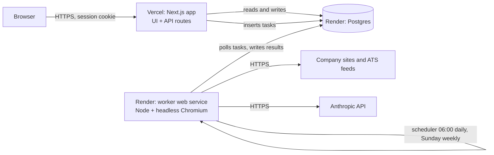
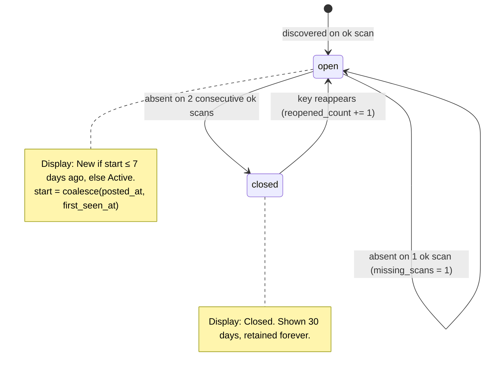

# Christopher — Careers Page Monitor

**Specification v0.4 (accounts and a shared company catalogue)** · 2026-09-16 · Multi-account tool

Christopher watches the careers pages of companies you list, once a day. It records which roles appeared and which disappeared, keeps only roles that match your keywords, and shows them in a table where you decide *apply* or *skip* with a reason. Those reasons train a preference model that ranks future roles and proposes changes to your filters. It also recommends companies similar to the ones you already track.

This document is written to be implemented from directly (by you or by Claude Code). Sections 3 to 7 and the v0.2 clarifications below are normative; section 9 is the acceptance bar. Requirements describe the target, not a claim that every feature has passed acceptance. See [REVIEW-PLAN.md](REVIEW-PLAN.md) for implementation and verification status.

---

## v0.4 accounts and the shared catalogue

Christopher serves several people from one deployment. What is yours and what is shared:

- **Accounts.** Sign up with an email address and password, or with Google. Administrator addresses come from `ADMIN_EMAILS` (default: the deployment owner). They may always sign up and become *administrators* only once the address is proven: a Google sign-in Google has verified, the confirmation link completed with the account's password, or a reset link used. Until then such an account cannot sign in, so registering someone else's address gains nothing. Everyone else may sign up only while an administrator has opened registration (a system setting, off by default) and joins as a *member*; members browse and set filters at once but add companies, run discovery or build CVs only after confirming their address. A session is a row in `sessions`; the cookie names it and is signed, so "sign out everywhere" takes effect immediately. Confirmation and reset links are single-use and completed by a POST, never by merely following the link. A Google identity whose email Google has verified may link to the account with the same address.
- **Per account:** the companies you follow (`company_subscriptions`, with your notes and pause/archive state); your view of each posting (`user_jobs`: gate result, fit score, archive); keyword, location, table and CV settings plus your monthly AI budget (`user_settings`); decisions and reason tags; the preference profile; filter and company suggestions; discovery sources; the CV library, drafts and applications. None of it is visible to another account.
- **Shared:** the company catalogue (`companies`, `career_sources`, discovery runs, company profiles) and every observed posting (`jobs`, with the scan's `job_events`). A company exists once however many people follow it. Adding a homepage that someone already tracks follows the existing company and admits its matching open roles to your table from the last scan, with no new scan. Administrators alone rename a company, change its homepage, delete a source or delete the company for everyone, from the Admin section; anyone may stop following.
- **One scan a day per company.** The daily run scans each company with at least one active follower exactly once and evaluates every follower's gate against what it observes. A manual rescan reuses a scan made in the last 30 minutes. The run is shared but its figures are not: the new-role count each account is shown counts only the postings that run stored which passed that account's gate. The schedule, models and robots policy are system settings an administrator sets; Health shows AI spend per account.
- **AI budgets are per account, and that is the only layer.** Every account has its own monthly budget (`aiBudgetUsd`, $25 to start): the account holder changes it on Settings and an administrator changes anyone's in Admin › Accounts. It is the sum of that account's `ai_calls` rows since the window began, so nothing has to keep a running total straight: the window starts at the beginning of the UTC month, or at that account's recorded reset (`aiBudgetResetAt`) when that is later, so resetting a counter moves the window and never deletes the call log. Work no account asked for (extraction, discovery) is charged to no budget; the deployment as a whole is bounded only by the operator's optional environment caps, `DAILY_AI_BUDGET_USD` and `DISCOVERY_AI_BUDGET_USD`, which are unset by default and are not a budget the product shows.
- **Migration.** Data from the earlier single-user deployment is held by a placeholder owner until an administrator address registers; that row becomes the person's account, with everything in it, once the address is proven.

## v0.3 priorities and acceptance

The user's order is: (1) reliable discovery, scraping and refresh of tracked company vacancies; (2) deterministic role and seniority filtering before the main table; (3) simple, reversible table clean-up; (4) a role-specific CV builder. Learning and company/job recommendations are useful later and must not delay these flows. Additional security and account-management work is deferred; existing session checks remain.

### Finding and filtering roles

- Anduril is the first supplied company. Its public homepage is a JavaScript shell. A verified catalogue mapping to `andurilindustries` must recheck the feed and company identity at discovery time, then fall back to normal discovery if verification fails. It does not silently replace another confirmed source.
- Generic discovery has a two-minute soft time budget (checked between requests), in addition to its fetch-count budget. Pending tasks are shown as queued or running and the companies page refreshes. A known board URL can be supplied before discovery finishes; an old queued homepage task cannot swallow that explicit URL.
- Role-keyword matches use OR within their list. Optional seniority-keyword matches use OR within their own list, against the title only. Role, seniority and location conditions use AND; exclusions win. Blank seniority allows every level. Failed filters stay in the internal source inventory for reconciliation, but never enter the main table, and nothing promotes them into it.
- Prefix terms are explicit: `strateg*` matches both strategy and strategic. Never infer candidate interest solely from a department label; website-facing departments can differ from the ATS taxonomy.
- The first user-confirmed positive example is **Associate Director, Strategic Execution - International**, London, requisition 13514, Greenhouse posting 5220149007. `strateg*` + `director` + London (remote disabled) includes this role and excludes its Costa Mesa counterpart. These are a starting test case, not learned preferences or a judgement on all future roles.
- Browser pagination retains every observed page, including pages replaced by JavaScript next buttons. Disabled controls stop traversal; stuck controls, loops and caps mark the observation incomplete. Incomplete scans cannot close unseen postings.

### Keeping the table clean

- Select rows on the page in front of you — selection is page-scoped, up to the 50 rows a page shows, and resets on pagination or navigation — then apply, skip or undo the group with one shared reason, or archive or restore the selection in a single submission. Skip requires a reason, given once for the whole group. Bulk decisions allow 100 roles; archive allows 500 per submission.
- A group is all or nothing: one selected role that is no longer this account's, a shared dismissal without a reason, or a selection over its limit writes nothing at all, so there is never a partly saved batch to reconcile. What a group does write is exactly what deciding those roles one at a time would: one active decision per role superseding the previous one, one event per role, and the same scoring and reason-tagging tasks, deduplicated per role and per account.
- Grouping combines identical titles within a company for display, preserves each posting and its source URL, and applies group decisions to all members. Expanded groups expose locations, individual decisions and per-posting CV links.
- Archive is a user-owned timestamp independent of open/closed status, gate membership and AI scores. Scans and filter saves preserve it. Archived roles leave the inbox but are accessible in the Archive view, including roles that no longer pass the gate. Restore makes a role eligible for the inbox only if it still passes the gate.

### CV builder

- Maintain an editable, ordered evidence library: name, contact details, LinkedIn profile URL, career overview, experience, education, skills and interests. Entries have stable IDs, headings and source evidence. Add/remove/reorder entries and import/export JSON. Library saves append immutable versions and reject obsolete edits.
- Create a CV from a stored role and description (or an explicit pasted description). Snapshot the job, library version and full evidence, plus model ID, before atomically enqueueing generation. CVs survive job/company deletion through snapshots.
- Use Anthropic with a separately editable `cvModel`, default `claude-fable-5-1`, chosen from the supported model list and distinct from scraping call site A3. Generation uses the worker's `ANTHROPIC_API_KEY` and the account's own monthly AI budget. Model configuration is captured per draft. Repeated queue delivery must not regenerate a completed draft.
- The model selects evidence IDs and tailors supported bullets/summary. Application code supplies name/contact/headings from the library and rejects invented or repeated evidence IDs. Instructions inside job descriptions or imported documents are data, not authority. Never deliberately fabricate skills, dates, employers, qualifications or metrics. Reference validation is not proof of semantic accuracy: the user reviews generated claims.
- Persist ready/failed state, actionable errors, generated content and review-only evidence gaps. Missing credentials or invalid model output produces a failed draft that can be regenerated; it must never be presented as a successful CV.
- A build is admitted against the AI budget once, up front, at what it is expected to cost (calibrated on recorded builds; about $3 for a 35 KB library on Fable 5.1), and refused before it spends anything with the limit, the amount left and the amount held by calls in flight named in the draft's error. It is admitted once, against the budget of the account that asked for it, whose refusal names that budget, what is left of it this month and that the person can raise it on Settings or ask an administrator; a refusal by one of the operator's optional environment caps names that cap instead. The calls inside an admitted build are not held again, so a build never fails part-way over budget accounting; a month can end at most one build over its budget.
- Every model call streams, so the request timeout bounds only the wait for the answer to begin, and a stream still open after fifteen minutes is cut off as stalled. The factual assessment is split into batches of eight requirements and claims that each see the complete CV and evidence. The batches are independent, so running them together changes no finding: the requirements and claims are spread evenly across them; the evidence library with the rubric, then the CV, precede each batch as cached blocks (so a revision's re-audit reads the library and rubric from cache and writes only the CV); the first batch runs alone until its response begins (when those cache entries become readable) and the rest run together. A batch that fails cancels the others, and the assessment is retried whole.
- The user can edit the summary and bullets and save a new immutable revision. The editor offers two actions: **Save Direct Edits** keeps the wording exactly as typed and assesses it (refitting only when it no longer meets the page limit), and **Rebuild from Library** writes a new revision afresh from the latest Library and writing preferences against the same rubric, applying the last assessment's system-owned improvements; direct edits are not carried into a rebuild except through remembered wording. "Remember wording corrections" applies to both and keeps the newest examples within the 12,000-character limit rather than refusing a save. Downloads always use saved content.
- Fitting ranks wording by the rubric's words weighted as the score weights them (a word from an essential requirement counts double), so what is trimmed under space pressure is what the assessment rewards least. A CV of two or more pages budgets one small interests block, trimmed before anything else. The notes describing what the fitter removed are shown with the assessment, and a subsidiary label kept in the evidence library stays with the confirmed wording it heads so the writer and the reviewer can tell which entity an achievement belongs to. The PDF uses selectable text, A4, a restrained black/grey style by default (Settings holds the default palette, typeface and page limit; every CV captures its own copy, editable per revision), chronological experience, one Education and Skills section with separate Education and Skills subsections (one bullet per qualification/certification), and optional interests, with page numbers and automatic page breaks. The typeface is Christopher (the renderer’s built-in Helvetica) or Arial (embedded as the metric-compatible Liberation Sans). A clickable LinkedIn label appears under the name when its URL is supplied. Enforce the CV’s page limit, chosen in Settings from one to five pages and three by default, at the fixed readable template size. Measure before marking generation ready, saving a revision, downloading, or recording an application. Generation may retry shortening twice; if it still exceeds the limit, report failure. Diagnostic previews may show all pages with a warning; never clip content. Skill pills apply to both structured labels and legacy skill bullets when enabled. Evidence gaps are excluded from the PDF.
- Library data and generated CVs belong in the user's database/downloads, not committed application fixtures. The supplied CV is an example and source evidence, not an instruction document. Interests absent from it remain blank.
- A build records the moment it last advanced — every stage change and every model call that returns, including each assessment batch — so a slow build can be told from a stopped one. A build that finishes or fails keeps its last such moment rather than a completion time. While a draft is queued or generating, its page shows when it started, the stage it reached, how long since it last advanced, and the attempt number and ceiling of the queue row behind it, and renders one of four states: **progressing**, ordinary work within the last ten minutes; **no progress**, nothing for ten minutes or more while its task still runs, named in minutes and pointing an administrator at Operations; **stopped**, when the task has failed, finished without publishing, or gone altogether — the draft's own error if it has one, otherwise a plain statement that the build stopped, with the retry and editing paths a failed draft has; and **waiting**, queued and not yet claimed. The page's existing status poll carries the staleness, so the elapsed figure keeps counting without a second timer. An in-flight build is never shown as a turning wheel alone: that said only that the page was still loading, which stayed true for hours after the process that was building it had died.
- A running background worker and Anthropic credentials are deployment prerequisites for live generation. Local fixture tests do not establish paid-model quality or production worker availability.

## v0.2 clarifications and acceptance gaps

- **R-1.6 — State changes and repeated submissions.** Archived companies are excluded from the main inbox. Queued scans recheck company state before fetching. Repeating a source confirmation is idempotent, including concurrent submissions; rediscovery retains prior user confirmation and proposes any different source.
- **R-3.11 — Run accounting.** Fan-out is atomic. A daily run remains unfinished while any associated company task is queued or running. A company without a usable source is unsuccessful. Company scans are serialised so overlapping manual and scheduled scans cannot reconcile the same source concurrently. Every run has its own task association even when another scan is already queued.
- **R-3.13 — Unverifiable HTML empties.** An HTML page with no verifiable postings is a failed extraction, including an unchanged page without a usable recipe or a disabled/unavailable model. A content hash alone never establishes an empty board. Structured feeds can still confirm a real empty result.
- **R-3.12 — Refresh semantics.** Subsequent observations refresh URLs, titles, locations, department, employment type, remote status, salary, posted dates and feed descriptions when supplied. Missing optional fields preserve stored data. Gate membership and matched terms are recalculated from the refreshed fields. Snapshots and their 14-day refresh do not require an enabled model or remaining AI budget.
- **R-4.9 — Partial observations.** A partial scan may add or refresh observed roles and reopen a positively observed role; it must not change any missing counter or close an absent role. Failed and suspect-empty scans do not change role state. The configurable closure threshold has a minimum of two, including legacy stored settings. “Consecutive successful scans” ignores intervening unsuccessful scans; only an ok observation resets the counter.
- **R-5.6 — Save consistency.** A gate change and reevaluation commit together before the settings action returns, including matched-term chips when membership is unchanged. Reevaluate all open roles and at least the last 30 days of closed roles. The worker may subsequently score newly eligible roles.
- **R-6.11 — Near-miss allowance.** Retired with R-6.10: nothing outside an account's gate is scored, so there is no allowance to reserve. Fit scoring is bounded by the account's monthly budget alone.
- **R-6.12 — Decision integrity.** Concurrent decisions on the same role are serialised. Undo supersedes the latest decision rather than deleting its audit record. Model learning uses only active decisions. Every mutation authenticates its session at the server action boundary.
- **R-7.6 — Ranking.** Unscored roles sort after scored roles for either fit-score direction and within the default status ordering.

- **R-6.13 — Versioned manual preferences.** Profile edits, pinned statements and answered questions append an immutable version. Forms identify their base version and reject obsolete submissions. No profile is required to save initial pinned statements. A model synthesis based on an older version cannot overwrite a newer user edit.
- **R-6.14 — Manual reason tags.** Users may approve proposed tags and edit active decisions using accepted vocabulary. A manual edit, including clearing tags, takes precedence over a queued or in-flight model tagging result.
- **R-3.14 — Bounded HTML traversal and cache.** Follow explicit same-origin next links for at most 20 pages and retain at most 500 postings. A broken later page, loop or unresolved limit produces a partial scan. Cache verified per-page postings with their content hashes; reuse them without a model call when unchanged. Keep compressed snapshots for the three most recent source scans, with HTTP response text capped at two million characters per scan. A pruned or invalid cache triggers fresh extraction. JavaScript-only next controls remain an acceptance gap.

### Explicit release gates

The real-company golden set, live ATS endpoint checks, real model/API capability and cost checks, a 50-company soak, backup restoration and learning calibration remain necessary. Unit fixtures do not establish live recall, provider availability or preference agreement. Do not describe the application as fully functional until the implementation matrix in REVIEW-PLAN.md and these acceptance checks are complete.

The review also identified features needing further implementation or acceptance evidence: JavaScript-only pagination and pagination-completeness signals, RSS/Atom discovery coverage, grouped decisions, in-app password changes, distributed login throttling, and global AI budget reservations. These requirements remain in scope; their absence is not hidden by changing the contract.

---

## Contents

1. [Decisions you should know about before reading further](#1-decisions-you-should-know-about-before-reading-further)
2. [Goals and non-goals](#2-goals-and-non-goals)
3. [Functional requirements](#3-functional-requirements)
   - 3.1 Company list
   - 3.2 Careers source discovery (homepage → careers page)
   - 3.3 Daily scan and job extraction
   - 3.4 Change detection, statuses, "live for"
   - 3.5 Keyword gate
   - 3.6 Decisions, reasons, and learning
   - 3.7 The interactive table and other screens
   - 3.8 Similar-company recommendations
   - 3.9 Health and attention panel
   - 3.10 Settings
4. [AI engine: call sites, models, guardrails](#4-ai-engine-call-sites-models-guardrails)
5. [Data model](#5-data-model)
6. [Architecture and hosting (Vercel + Render)](#6-architecture-and-hosting-vercel--render)
7. [Scraping policy and robustness](#7-scraping-policy-and-robustness)
8. [Tech stack](#8-tech-stack)
9. [Quality bar and test plan](#9-quality-bar-and-test-plan)
10. [Running cost](#10-running-cost)
11. [Delivery plan](#11-delivery-plan)
12. [Open questions for you](#12-open-questions-for-you)
- Appendix A: ATS fingerprints and endpoints
- Appendix B: Status state machine
- Appendix C: Example preference profile
- Appendix D: Requirements traceability

---

## 1. Decisions you should know about before reading further

These are the places where the literal request cannot be delivered as stated, or where there is a real design choice. Each has a recommendation; the rest of the document assumes it.

**1. "How long it has been live" is only partly knowable.** A careers page rarely states when a role was posted. Applicant tracking systems (ATSs) with public JSON feeds often do (Greenhouse, Lever, Ashby, Workday and others expose a published/created timestamp). For plain HTML pages the only honest number is *how long since this tool first saw it*. The table therefore shows `live for` computed from the ATS posted date when available, otherwise from first-seen, and marks which one it is. Roles found on the very first scan of a newly added company are flagged as *seeded* so a day-one "12 roles, all new" does not mislead you.

**2. Keywords and learning pull in opposite directions; the spec resolves this explicitly.** You asked for the table to contain only keyword-matched roles, and for the AI to use your reasons to inform which roles are included in future. Learning cannot add roles the keyword gate has already removed unless there is a channel for it. The design:
- The keyword gate stays a hard, user-controlled filter on what is in the main table.
- Within the table, every role gets a fit score (0–100) and a one-line rationale from the preference model. Low scorers can be auto-collapsed once you turn that on; nothing is silently deleted.
- The model *proposes* keyword and filter changes with evidence; you accept or reject them.
- A separate, clearly labelled section, "Outside your keywords", shows up to ten new roles per day that failed the gate but score highly. This is the one place the spec goes beyond the literal request. It is a setting, on by default, because it is the mechanism that lets learning widen your search rather than only narrow it. Turn it off and the behaviour is exactly what you asked for.

**3. Prefer ATS APIs to HTML scraping; scrape HTML only as a fallback.** Most careers pages are hosted on or embed one of roughly a dozen ATS platforms, and those platforms publish JSON feeds intended for job boards. Detecting the ATS and reading its feed is far more reliable than parsing HTML and gives you IDs, locations, departments, posted dates and full descriptions for free. This is where most of the "search accurately" sophistication lives. HTML extraction (with a self-healing selector recipe, see 3.3) is the fallback for the remainder.

**4. Discovery is automatic but confirmed once when unsure.** From a homepage URL the system will usually find the careers source on its own. When its confidence is below a threshold it shows you its best candidates with a preview of the roles it found there, and you click one (or paste a URL). A five-second confirmation per company beats a silently wrong source that reports nothing for months. Sources that stop working trigger re-discovery automatically.

**5. "Closed" is inferred, so it is inferred conservatively.** A role disappearing from a page might be a scrape failure. A role is marked closed only after it is absent from two consecutive *successful* scans, and a scan whose result looks broken (fetch error, zero roles where there were many) never closes anything.

**6. Learning is a maintained profile plus retrieval, not fine-tuning.** For one user with tens to hundreds of decisions, the right mechanism is a versioned, human-readable preference profile synthesised from your decisions and reasons, fed to the model as context when it scores each new role, together with a digest of your past decisions. You can read and edit the profile. It is auditable, cheap, and improves from the first decision.

**7. Company recommendations must be verified before you see them.** Language models propose plausible-sounding companies that do not exist or are mis-described. Every suggestion is checked deterministically (homepage resolves, a careers source is discoverable, open roles counted) before it is shown.

**8. Hosting: UI on Vercel, worker and database on Render.** Vercel runs the Next.js interface. A single always-on Render web service runs the scheduler, the scrapers (with headless Chromium) and all AI calls, and Render hosts Postgres. The only integration point between the two platforms is the database; the UI never calls the worker directly, it enqueues tasks in a table. If cross-platform database access proves irritating, moving the UI to a second Render service is a one-afternoon change with no code impact. Cost is roughly $14/month for Render plus API usage (section 10).

---

## 2. Goals and non-goals

### Goals

- Add a company by pasting its homepage URL; the system finds and verifies its careers source.
- Scan every active company once a day; detect new and removed roles.
- Show keyword-matched roles in a table with: company, website, role, link to the description, live-for, status (New / Active / Closed).
- Let you record apply/skip with a reason on each role, quickly (keyboard-first).
- Learn from decisions and reasons: rank roles within the gate and suggest filter changes to accept or reject.
- Recommend companies very similar to the ones you track, verified to be real and hiring.
- Be reliable and quiet: no false "closed", no duplicate rows, failures surfaced in one place.
- Serve several people from one deployment: separate accounts, filters, learning and CVs; one shared company catalogue, scanned once a day.

### Non-goals (v1)

- Sharing one account's data with another, teams, or public access. Accounts are separate; only the company catalogue and observed postings are shared.
- Applying on your behalf and cover letters. CV tailoring is included in v0.3 below.
- Aggregator sources (LinkedIn, Indeed, Otta). Company pages only.
- Email or push notifications (natural v2; the "New" filter is the daily inbox).
- Historical backfill of roles posted before a company was added.
- Solving CAPTCHAs or evading bot protection. Blocked sources are reported, not fought.

---

## 3. Functional requirements

Requirement IDs (R-x.y) are referenced by the test plan.

### 3.1 Company list

- **R-1.1** Add a company by homepage URL. Name is derived from the page title / `og:site_name` and editable. Favicon fetched for display.
- **R-1.2** Company states: `active` (scanned daily), `paused` (kept, not scanned), `archived` (hidden, data retained).
- **R-1.3** A company can have more than one careers source (e.g. a Greenhouse board plus a separate internships page). Scans union them.
- **R-1.4** Bulk add by pasting a list of URLs (one per line). Each is discovered independently.
- **R-1.5** Deleting a company (administrators only) requires confirmation and cascades to its postings and every follower's views; decisions remain in each learning corpus (anonymised to title/company name). Stopping following removes only your subscription and views.
- **R-1.6** Companies are shared. Adding a homepage URL already in the catalogue follows the existing company rather than creating a second one, and its matching open roles enter your table immediately from the last scan. The states in R-1.2 are per follower; the shared company is scanned while any follower is active, once a day.

### 3.2 Careers source discovery (homepage → careers page)

Input: a homepage URL. Output: zero or more `career_sources` with a type, URL, confidence and a preview of roles found. Runs as a worker task; the UI shows progress and the result within about a minute.

Pipeline, in order. Every step adds candidates with a confidence; the best candidate decides the outcome.

1. **Normalise and fetch the homepage.** Follow redirects, record the canonical domain. Fetch with plain HTTP first; if the page has very little text or few links (a JavaScript shell), re-fetch with headless Chromium. If the homepage refuses the fetch outright (bot protection: 403, 429, a challenge page), render it with headless Chromium instead; if that fails too, skip step 2 but **still run steps 3 to 6** against the given domain — the careers page is usually on another host or a hosted board that is not protected.
2. **Harvest and score links.** Collect every anchor on the homepage (header and footer especially). If nothing careers-like is found there, harvest `/about`, `/about-us`, `/company` and `/team` the same way (at most three fetches) before probing blind paths — sites that keep Careers under About or in a rendered menu show nothing on the homepage itself. Score by anchor text against a careers vocabulary (careers, jobs, join us, join the team, work with us, we're hiring, open roles, open positions, vacancies, opportunities, life at …, plus common non-English equivalents: Karriere, Jobs, Carrières, Empleo, Trabaja con nosotros, Vacatures, Lavora con noi), by path (`/careers`, `/jobs`, `/join`, `/join-us`, `/work-with-us`, `/company/careers`, `/about/careers`, `/vacancies`, `/opportunities`, with optional locale prefix) and by ATS hostnames (Appendix A).
3. **Probe well-known paths** on the same domain and the subdomains `careers.`, `jobs.`, `join.`. Treat soft-404s (200 with "not found" in title/body) as misses.
4. **Read robots.txt and sitemaps** for career-like URLs and job-detail URL patterns (capped at 2,000 sitemap entries).
5. **Fingerprint the ATS.** Across everything fetched, look for links, iframes and scripts that reveal an ATS and its account slug (Appendix A). A slug *discovered on the company's own pages* is strong evidence. A slug *guessed from the domain name* (e.g. `acme` from `acme.com`) is weak evidence and always requires confirmation, because slugs collide.
6. **Verify structured sources** by calling the ATS feed. Success means HTTP 200, parseable, and (where the feed exposes it) a company name that fuzzy-matches the homepage title.
7. **Classify candidate pages.** For the top five same-domain candidates decide whether each is a job *listing* (has job-detail links, JSON-LD `JobPosting`, or an embedded ATS), a *landing* page that links onward (follow one more hop), or neither. Heuristics first; the model (call site A2) only when heuristics are inconclusive.
8. **Score and decide.**

| Evidence | Confidence |
|---|---|
| ATS feed verified, slug discovered on company pages, name matches or feed has ≥1 role | 0.95 |
| ATS feed verified, slug guessed from domain | 0.70 |
| Same-domain page with JSON-LD `JobPosting` or ≥3 job-detail links | 0.85 |
| Same-domain page reached via careers-vocabulary link, model says listing | 0.75 |
| Careers landing page found, no listing reached within one hop | 0.50 |
| Nothing found | 0 |

- **R-2.1** Confidence ≥ 0.85: accept automatically, badge the source "auto-detected", run the first scan.
- **R-2.2** 0.50 ≤ confidence < 0.85: mark `needs_confirmation`. UI shows up to three candidates, each with URL, detected type and three sample role titles. One click confirms.
- **R-2.3** Confidence < 0.50: UI says it could not find the careers page and asks for a URL. Any pasted URL (including a bare ATS board URL) is run through steps 5 to 7.
- **R-2.4** Every discovery run stores its candidate list and log for debugging.
- **R-2.5** Re-discovery is triggered automatically after 3 consecutive failed scans, after a scan that returns zero roles where the previous successful scan had ≥3, after 3 consecutive scans whose listing is below 30% of the last successful scan's count (an ATS migration while the old board still serves a shrinking remainder; those scans are `partial` and close nothing), or manually. If re-discovery finds a different high-confidence source (typical when a company migrates ATS), it is proposed for confirmation, not swapped silently.
- **R-2.6** Target: ≥80% of companies in the golden set (section 9) resolve automatically at ≥0.85 with the correct source; zero cases of a wrong source accepted automatically.

### 3.3 Daily scan and job extraction

- **R-3.1** A daily run starts at the configured local time (default 06:00) and enqueues one `scan_company` task per active company. Tasks execute across distinct domains (`WORKER_CONCURRENCY` slots, six on the deployed worker), one request per 2 seconds per domain, a 3-minute budget per company enforced as a per-task deadline, one retry on transient failure. A run for one company never blocks another.
- **R-3.2** Each source type has an adapter that returns normalised postings: `external_id?, title, url, location?, department?, employment_type?, remote?, posted_at?, updated_at?, description?, salary_text?`.
- **R-3.3** Adapter tiers:
  - *Tier 1, structured JSON/XML feeds (v1)*: Greenhouse, Lever, Ashby, Workable, SmartRecruiters, Recruitee, Personio, BambooHR, Workday, Pinpoint, Breezy; plus generic JSON-LD `JobPosting` and RSS/Atom feeds.
  - *Tier 2, HTML with known structure (v1.x)*: Teamtailor, iCIMS, Jobvite, JazzHR, Rippling, SAP SuccessFactors, Oracle Cloud HCM/Taleo, Eightfold, Phenom, Welcome to the Jungle.
  - *Tier 3, generic HTML via model extraction (v1)*: anything else.
- **R-3.4** Tier 3 extraction: render with headless Chromium (dismiss cookie banners with a list of common selectors, scroll to bottom, click "load more" up to 10 times, follow pagination up to 20 pages). Prefer embedded structure first (JSON-LD, `__NEXT_DATA__`, inline JSON). Otherwise build a compact representation of the page (each anchor's text, href and nearby text) and ask the model (A3) for the list of postings **and a selector recipe** (`list_item`, `title`, `link`, `location` selectors).
- **R-3.5a** Render reuse. A server-rendered listing with a "load more" control is rendered with the browser to reach the rest of it. When the first page over plain HTTP is byte-identical to the page behind the last render, that capture is reused and the browser is not launched — for at most seven days, after which the page is rendered regardless. A JavaScript shell (zero postings over HTTP) is rendered on every scan: its static markup says nothing about what the board lists today.
- **R-3.5** Self-healing recipes. The recipe is validated against the same page (must reproduce ≥90% of the model's postings) and stored on the source. Subsequent scans run the recipe deterministically at zero AI cost. If the recipe yields zero postings or fails validation, and the page content hash has changed, the model is called again and the recipe replaced. Pages whose content hash is unchanged since the last scan skip extraction entirely.
- **R-3.6** Anti-hallucination validation of model extraction: every returned URL must be present in the harvested anchor set; every title must appear in page text (fuzzy ≥0.9). Violators are dropped; if more than 20% violate, the scan is marked `partial`.
- **R-3.7** Job description snapshot. For postings that pass the keyword gate, store the description text (from the feed when the ATS supplies it; otherwise fetch the detail page and extract the main content). Cap 30k characters. Re-fetch when the source's `updated_at` changes or every 14 days. This keeps the description readable after the role closes and the link dies.
- **R-3.7a** Sources that list roles without descriptions and serve one description per request (Greenhouse, SmartRecruiters) are read that way: the listing is one bounded request and each description is a `fetch_description` task. A gate that matches on the description therefore cannot judge such a posting at scan time. It is **deferred, never rejected**: the posting is stored, a description task is queued for it even though no account has admitted it yet, and every follower's gate is re-run when the text arrives. The listing itself is complete, so the scan is still `ok` and may still close roles. The first scan of a 2,331-role board with a description-matching follower queues 2,331 description tasks once; dedupe keys prevent duplicates and later scans queue only postings that are new or still have no stored text. The number is not capped: a silent cap would hide roles from the gate.
- **R-3.8** Scan outcome: `ok`, `partial` (some postings dropped by validation, or count fell >70% from the previous ok scan), `suspect_empty` (zero postings where the previous ok scan had ≥3), `failed` (fetch error, HTTP ≥400, bot-protection challenge, parser exception). Only `ok` scans may close roles (3.4).
- **R-3.9** Every adapter retains all valid roles up to 10,000 per source, with no silent truncation: a source that reaches the cap is recorded as `partial`, so it can never close roles. An adapter that stops earlier than the cap — a paging budget spent with pages still to read, or a feed reporting more roles than it returned — says so rather than returning the short list as complete, and that scan is `partial` too; the roles it did read are still stored and reconciled. Response bodies are bounded twice: each adapter asks for what its feed needs (Greenhouse: 8 MB for the listing, 2 MB for one description) and the fetcher enforces a hard 16 MB ceiling that no caller can raise, because decoding a 41 MB board into a string is what exhausted the worker's heap and crash-looped it. Exceeding either is an explicit failure, i.e. a failed scan that closes nothing. The bytes read for a listing are recorded on the scan row (`scans.fetched_bytes`) and logged with the worker's heap use, so the largest inputs are visible before they become an incident. The revalidation cache keeps only small bodies and is capped in total, oldest evicted first. Generic HTML traversal is bounded to 20 pages / 500 roles; hitting a bound is partial for the same reason. Oversized HTTP responses fail explicitly. Store compressed evidence for the last three scans of a source: every parsed posting plus a bounded head of each raw response, never the raw body alone (a large feed's body is mostly beyond any sensible cap and could not be replayed).
- **R-3.10** Manual "Rescan now" per company and "Run daily scan now" globally.

### 3.4 Change detection, statuses, "live for"

- **R-4.1** Job identity key, per source: the ATS `external_id` when present; otherwise the normalised URL (lowercase host, strip fragment, strip tracking parameters such as `utm_*`, `gh_src`, `lever-source`, `source`, `ref`, strip trailing slash); otherwise a hash of normalised title + location.
- **R-4.2** On an `ok` scan: new key → insert job (`first_seen_at = now`, `posted_at` from the feed if present, `status = open`); existing key → update `last_seen_at`, refresh changed fields, log an `updated` event if title, location or description changed; open job absent → `missing_scans += 1`; when `missing_scans` reaches 2 → `status = closed`, `closed_at = last_seen_at`.
- **R-4.3** A closed job whose key reappears is reopened (`reopened_count += 1`, event logged). A new posting whose normalised title and location match a job at the same company closed within 30 days is linked as `repost_of` (informational).
- **R-4.4** Display status is derived: **New** = open and `coalesce(posted_at, first_seen_at)` within the last 7 days; **Active** = open and older; **Closed** = closed. Closed roles are shown for 30 days by default and retained indefinitely.
- **R-4.5** `live for` = today − `coalesce(posted_at, first_seen_at)` while open, or `closed_at` − that start once closed. The UI marks values derived from first-seen with a small indicator and a tooltip ("Source does not publish a posted date; counted from when this tool first saw the role").
- **R-4.6** Postings found on a company's first successful scan are flagged `seeded`. They still show as New for 7 days (they are new to you) but carry the seeded marker.
- **R-4.7** Scans that are not `ok` never change `missing_scans` or close anything.
- **R-4.8** Roles that are identical in title at the same company but differ in location (common on Greenhouse) remain separate rows; the table offers "group by role" which merges them into one expandable row, and a decision on the group applies to all members.

### 3.5 Keyword gate

- **R-5.1** Settings: `include_keywords` (default `["operations"]`), `exclude_keywords` (default empty), `match_fields` (default title; optional department, description), `location_filter` (optional list of allowed location substrings or countries, plus an include-remote flag).
- **R-5.2** Matching is case-insensitive and word-boundary aware; a quoted phrase matches exactly and treats `*` literally; a trailing `*` matches a prefix (`operat*` → Operations, Operational), a leading `*` a suffix (`*ops` → DevOps, RevOps), and inside a phrase the wildcard widens only its own word (`strateg* lead`). A bare `*` matches nothing. Any exclude match wins. Description matching uses text the feed already supplies; for HTML sources it is title and department only unless enabled per company (it requires a detail fetch per posting).
- **R-5.3** Every posting from every scan is stored once in the shared `jobs` table regardless of anyone's gate. Each follower's gate is evaluated separately and recorded in `user_jobs`; a view is created when the gate passes, and only views with `in_table = matched AND NOT excluded AND location_ok` appear in that account's table. Storing every posting is what makes keyword changes retroactive without a rescan.
- **R-5.4** Changing keywords re-evaluates all open roles and roles closed in the last 30 days immediately; the table reflects the new gate without waiting for the next scan.
- **R-5.5** The matched terms are stored per job and shown in the row (e.g. a chip "operations").
- **R-5.6** Suggestions from scans. After every daily run (and on demand from Learning), the latest scan evidence of every active source is mined, without a model call, for what the gate turns away in the user's locations: seniority labels from a fixed vocabulary that would admit roles already matching the role keywords ("Lead" admitting nine London roles), and role-type words the include list does not cover, proposed as a wildcard when the word appears in several inflections (`partnership*`). Level words (manager, analyst, senior…) are never proposed as role types. Each suggestion carries the count, the companies and three example titles, and is accepted or rejected like any other filter suggestion; accepting a seniority label adds it to the seniority list.

### 3.6 Decisions, reasons, and learning

- **R-6.1** On any role you can set `apply` or `skip`. A reason is required for `skip` and encouraged for `apply` (the UI nudges: "one line on why helps the ranking"). Decisions can be changed; the previous one is kept as superseded. The same applies to a selected group of up to 100 roles decided together on one shared reason: one transaction, saved whole or not at all.
- **R-6.2** Reason tagging (A6). After saving, the model maps the free-text reason onto a controlled, growing tag vocabulary, e.g. `seniority:too_junior`, `seniority:too_senior`, `location:not_commutable`, `location:wrong_country`, `domain:uninterested`, `domain:interested`, `role_type:not_operations`, `company:stage`, `company:sector`, `comp:too_low`, `title:mismatch`, `timing`, `already_applied`. Tags are shown and editable. New tags proposed by the model are added to the vocabulary once you have accepted them.
- **R-6.3** Seed profile. At setup you write a few sentences about what you are looking for (seniority, sectors, locations, compensation floor, deal-breakers). This is the starting point for the preference profile and is never overwritten.
- **R-6.4** Preference profile (A7). A versioned markdown document synthesised by the model from the seed profile, all decisions with reasons and tags, and the current keywords. Regenerated when five or more new decisions have accumulated since the last version, or weekly. Sections: target roles; seniority band; locations; sectors and companies preferred and avoided; deal-breakers; positive signals; open questions. Statements you edit or add are *pinned* and must be preserved verbatim by later syntheses. Every version is kept and diffable.
- **R-6.5** Open questions. When the synthesiser is unsure how to generalise (for example, two skipped logistics roles: the sector, or those two companies?), it writes a question. Questions appear on the Learning page; your answer becomes a pinned statement.
- **R-6.6** Fit scoring (A5). Each role entering the table is scored 0–100 with a verdict (`strong` / `possible` / `unlikely`) and a rationale of at most two sentences, using the current profile, a compact digest of your last 100 decisions, and the role's title, company, location, department and description excerpt. Roles are re-scored when a new profile version is published.
- **R-6.7** Use of the score: default sort is status (New first) then score descending; the rationale shows on hover or row expand. The score never removes a role from the table: the minimum-fit filter on Roles is the only way a score narrows what is shown, and it is the reader's to set. (The optional hide threshold is retired; stored `hideThreshold` values are ignored, and a stored `hide_threshold` suggestion is settled rather than applied.)
- **R-6.8** Calibration. After 20 decisions the Learning page shows agreement: the apply rate among roles scored ≥70 and the skip rate among roles scored <30, with counts. Disagreements are fed to the next profile synthesis as explicit cases to reconcile. Target after 50 decisions: ≥75% agreement in both buckets. This is a hypothesis to measure, not a guarantee.
- **R-6.9** Filter suggestions (A8). Weekly, the model reviews decisions and proposes changes: add an include keyword, add a seniority label, add an exclude keyword, add or change a location filter, pause a company. Each carries evidence (the decisions that support it). Accept applies it; reject suppresses that suggestion for 60 days. It never proposes hiding roles by score.
- **R-6.10** Near-miss surfacing is **retired**, and with it its setting, its daily cap and its section. A posting that fails an account's gate gets no view, no score and no model call for that account; widening the keywords is how such a role reaches the table. Stored `near_miss` flags and the decisions taken on them stay readable and keep counting as decisions.
- **R-6.11** Every AI call is logged with tokens and cost, against the account it was made for where there is one. One monthly budget bounds the spend: the account's own (`aiBudgetUsd`, $25 by default, set by its holder on Settings or by an administrator in Admin › Accounts). A call made for an account is held against that account's budget — its recorded spend plus its own live holds — and a refusal stops the work and names the budget, what is left and what its calls in flight are holding. Exceeding it stops that account's non-essential calls (company and filter suggestions) and the UI says so; work already queued for an exhausted account is skipped and finishes, never failed and retried. The budget counts from the start of the UTC month or from that account's later recorded reset, so a counter can be zeroed without touching the call log; reports read spend per account, call site and model. Work no account asked for is bounded only by the operator's optional `DAILY_AI_BUDGET_USD` and `DISCOVERY_AI_BUDGET_USD`, which apply to the whole deployment, refuse any call including a build, and are unlimited unless set.

### 3.7 The interactive table and other screens

**Roles table (home).** Columns: Company (favicon + name), Website (link icon), Role (title, linking to the live description in a new tab), Location, Live for (e.g. `3d`, `6w`, with the first-seen marker), Status chip (New / Active / Closed), Fit (score; rationale on hover), Decision (Apply / Skip; opens a reason field), Reason (truncated, click to edit), Source badge (Greenhouse, Lever, HTML …). Row expand shows the stored description, matched keywords, tags, scan history and events.

- **R-7.1** Filters: status (multi), company, decision state (undecided / apply / skip), minimum fit, show hidden, show closed, free-text search. Sorting on every column. Filter state persists in the URL.
- **R-7.2** Keyboard: `j`/`k` move, `a` apply, `s` skip (focus reason), `enter` save, `o` open description, `g` toggle group-by-role. Multi-select with `x`; bulk skip with one reason.
- **R-7.3** Header banner: last run time and outcome ("Today 06:03 · 28 of 30 companies OK · 4 new roles"), linking to the Health panel when anything failed.
- **R-7.4** Sections below the table: "Outside your keywords" (3.6) and "Hidden by your preferences" (collapsed).
- **R-7.5** CSV export of the current filtered view.

**Companies.** List with source type, confidence badge, last scan status, open/matched role counts, actions (rescan, re-discover, edit source URL, pause, archive). Company detail shows sources, scan history with outcomes and durations, and all roles including closed.

**Suggestions.** Similar-company recommendations (3.8) with accept / reject-with-reason.

**Learning.** Current profile (editable, pinned statements highlighted), version history, open questions, calibration numbers, pending filter suggestions.

**Health.** Failed and suspect scans, sources needing confirmation, blocked sources, re-discovery proposals, total AI spend this month with usage by account, feature and model, and each account's spend against its own budget in Accounts.

**Settings.** Keywords, location filter, how long closed roles stay in view, daily run time and timezone, seed profile text, this account's own monthly AI budget and what it has spent, password change.

### 3.8 Similar-company recommendations

- **R-8.1** Company profiling (A9). When a company is added (and quarterly), fetch its homepage and about page and produce a profile: one-liner, sector, sub-sector, business model, customer type, stage, size band, HQ country, operating geographies, tags. Stored and shown on the company detail page.
- **R-8.2** Candidate generation (A10). Weekly (Sunday) and on demand, the model is given the portfolio of profiles, your preference profile, and previously rejected suggestions with reasons, and asked for 15 candidates, each with a homepage URL, the listed companies it most resembles, and why. The call uses the server-side web search tool so that each candidate is grounded in a search result rather than recalled from memory.
- **R-8.3** Verification (deterministic, mandatory). Homepage resolves (HTTP 200, not a parked or for-sale page); domain not already in your list and not rejected within 180 days; the discovery pipeline in probe mode finds a careers source; open roles are counted; keyword-matching roles are counted. Candidates that fail the first three checks are discarded before you see them.
- **R-8.4** Presentation. Up to 10 suggestions per week, ranked by similarity confidence, then number of currently matching roles. Each shows: name, one-liner, "similar to" chips, open roles, matching roles, rationale. Accept adds the company (with its already-discovered source) and runs the first scan. Reject requires a reason, which feeds the preference profile (for example "no agencies", "not fintech").
- **R-8.5** A suggestion is never shown twice unless it was expired unseen for 90 days.

### 3.9 Health and attention panel

- **R-9.1** Anything that needs you appears here and nowhere else: sources needing confirmation, three consecutive failures, suspect empties, blocked sources, re-discovery proposals, AI budget exceeded, companies with no source.
- **R-9.2** Each item has a one-click resolution path (confirm candidate, paste URL, pause company, dismiss).
- **R-9.3** Worker status. The heartbeat is rewritten on every boot, so its freshness cannot say whether the worker is running: a process that crashes and restarts every few minutes writes a fresh one each time. Operations therefore states one of three things. `stopped`: nothing reported for over two minutes (four missed heartbeats), or nothing has ever reported. `restarting`: two or more crash recoveries recorded in the last hour. `healthy`: otherwise. Alongside it: the crash-recovery count for the last 24 hours, uptime since the last boot, worker id, release, slots and active tasks, and the heap reading against the ceiling V8 aborts the process at ("184 of 258 MB heap, 71%"), in warn tone at or above 85%. Heap pressure is reported but does not by itself change the state. The account-facing Health page shows one plain sentence from the same derivation when the worker is restarting or stopped, and the ordinary "worker reported N ago" otherwise.
- **R-9.4** Crash suspects. An out-of-memory kill runs no handler and writes no error, so the tasks the dead process held are the only evidence. Operations shows the last crash recovery: when, which worker booted into it, and each task it found still claimed — type, attempts, when and by whom it was claimed, and a human subject (company name, "CV: company · title", account email). The likeliest, the one with the most attempts, is listed first and marked, because a crash never counts as a failed attempt and the task that keeps killing the worker is the one with an impossible attempt count.
- **R-9.5** Running and retrying tasks. Running: type, subject, when it started, elapsed against that type's deadline, attempt and which worker holds it. Retrying: queued tasks that have already been tried and carry an error — what a crash or a deadline handed back — with the error text and the next run time. Deadlines come from the shared table in `packages/core`, so the interface and the worker cannot disagree about them.
- **R-9.6** Worker events. The last thirty entries of the worker's ledger — boots, shutdowns, crash recoveries, abandoned tasks, deadline abandonments, released budget holds — as a timeline with each entry's subject and a one-line detail. The interface may be serving before the worker has run the migration that creates the ledger; a missing ledger reads as "nothing recorded", never as an error.
- **R-9.7** Largest scan inputs. The biggest listing each source returned in the last seven days, top ten, with the company, source type, fetch method, size, the requests that scan made and how many came back 304 — stated against the heap ceiling above, because a scan holds its input in memory while it extracts from it and these are the pages that can end the process. The ranking is done in the database: reading every source's largest scan to show ten of them is a row per source in the catalogue.
- **R-9.8** Outbound traffic. One line per host the deployment fetched from in the last seven days, from the per-host daily rollup: requests, bytes, the share of requests that went through the headless browser, the share answered 304, the share rate-limited, and the counts blocked, denied by robots and rejected by the per-scan cap, with a p95 latency read off the rollup's buckets (the upper bound of the bucket the cumulative count crosses 95% in; the top bucket is open, so a host there reads "over 15s"). Beside each, the same seven days ending a week earlier, as a requests and bytes delta. Sorted by requests. A host over 1% rate-limited, or with any blocked response, is shown in warn tone: the first is a vendor pacing us and the second is one refusing us, and both are answered by slowing that host rather than retrying it. This is the record that answers "is a vendor throttling us"; the per-request log line does not survive long enough to.
- **R-9.9** AI performance and cost per build. Per feature, model and account: calls, p50 and p95 duration, the cache hit ratio (`cache_read / (input + cache_read + cache_write)`), and failures split by the outcome taxonomy below. Beside it, the last twenty CV builds itemised by stage, with the median and the worst, and what scoring one role costs over thirty days. A build's stages are what make its bill explicable: a build that paid twice for one audit batch shows `review_retry`, and a build that merely read a long description shows it under `rubric` and `author`.

### 3.10 Settings

Listed in 3.7. All settings live in one `settings` table as key/value JSON and are editable without redeploying.

---

## 4. AI engine: call sites, models, guardrails

All calls go through the Anthropic Messages API using the official TypeScript SDK (`@anthropic-ai/sdk`). Default model for every call site is `claude-sonnet-5`. Structured outputs (`output_config.format` with a Zod schema via `zodOutputFormat`) are used everywhere a schema is listed, so responses are validated before use. Adaptive thinking is left on; `output_config.effort` is set per call site. Prompt caching is applied to the stable prefix (instructions, profile, decision digest) so the per-role suffix is the only uncached input. The server-side refusal fallback is enabled so a safety-classifier refusal on scraped content degrades to another model rather than failing the scan.

| ID | Call site | Trigger | Input | Output (schema) | Effort | Typical tokens (in / out) |
|---|---|---|---|---|---|---|
| A1 | Careers link disambiguation | Discovery, when heuristics tie or are weak | Company name; up to 300 harvested links (text, href) | `{candidates: [{url, confidence, reason}]}` | low | 3k / 0.2k |
| A2 | Listing-page classification | Discovery, inconclusive heuristics | Page text excerpt; link pattern summary | `{kind: listing\|landing\|other, next_hop_url?, confidence}` | low | 4k / 0.1k |
| A3 | HTML posting extraction + selector recipe | Tier-3 scan, content hash changed and no valid recipe | Compact DOM (anchors + surrounding text), ≤20k tokens | `{postings: [{title, url, location?, department?}], recipe: {...}, confidence}` | low | 15k / 2k |
| A4 | Description clean-up (only when heuristic extraction is poor) | Detail fetch | Raw page text | `{description_text, salary_text?, employment_type?, remote?}` | low | 5k / 1.5k |
| A5 | Fit scoring | Role enters table; profile version change | Cached: instructions + profile + last-100-decision digest. Uncached: role fields + description excerpt (≤1.5k tokens) | `{score, verdict, rationale, flags[]}` | low | 3k cached + 1.5k / 0.15k |
| A6 | Reason tagging | Decision saved | Reason text, role summary, tag vocabulary | `{tags[], proposed_new_tags[]}` | low | 1k / 0.1k |
| A7 | Profile synthesis | ≥5 new decisions or weekly | Seed profile, pinned statements, all decisions (title, company, location, department, snippet, decision, reason, tags), current profile, calibration disagreements | Markdown profile + `{open_questions[]}` | high | 10k / 2k |
| A8 | Filter suggestions | Weekly | Decisions, current filters, past rejected suggestions | `{suggestions: [{type, value, evidence[]}]}` | high | 6k / 0.5k |
| A9 | Company profiling | Company added; quarterly | Homepage + about text (≤6k tokens) | Company profile schema | low | 6k / 0.3k |
| A10 | Similar-company generation | Weekly; on demand | Portfolio profiles, preference profile, rejected suggestions; tool `web_search_20260209` (max 15 uses) | `{candidates: [{name, homepage_url, similar_to[], rationale, confidence}]}` | high | 8k / 2k + searches |

Guardrails common to all call sites:

- Outputs are schema-validated; anything else is discarded and the pipeline falls back (heuristic extraction, unscored role, no suggestion) rather than failing the run.
- Extraction outputs (A3) must reference only URLs and titles present on the page (R-3.6).
- Scores are clamped; tags must come from the vocabulary or be explicitly proposed.
- Scraped page content is untrusted. It is placed in the user turn, clearly delimited, with an instruction that it is data; nothing in it can change the task. No tool that acts on the world is exposed to A3/A4.
- Every call writes an `ai_calls` row (call site, model, tokens, cache reads, cost, duration, outcome, the account it was for when there is one, and — for a feature that makes several calls — which step of it this was). Operations shows total spend for the month with usage by account, feature and model, the same lines again with latency and cache hit rate, and the last twenty CV builds itemised by step; Accounts shows each account against its own budget and window.
- **Stages.** A multi-call feature names its steps, so its bill can be explained rather than only summed. A CV build writes `rubric`, `author`, `review`, and `review_retry` for the re-run of an audit batch whose source attribution had to be corrected. A single-call feature records no stage.
- **The outcome taxonomy.** `ok` is a call that returned a valid result. `cancelled` is a batch this engine stopped paying for because a sibling in the same task had already failed — a cost deliberately cut short, not a fault. `stalled` is a stream cut off at the fifteen-minute ceiling: a vendor symptom. `failed` is everything else, and is the only one an operator should chase. The taxonomy is derived from the recorded `ok` and error text rather than stored, so no column carries it and rows written before it existed classify the same way. Counting a cancellation as a failure turns one bad build into four broken calls, which is exactly the figure someone would act on.
- Server-side tool use is billed per request as well as by the tokens it returns, so a call's recorded cost includes its web searches. A failed call is priced at the model that served it, as a successful one is, because a server-side fallback bills at the model that answered rather than the one that was asked for.
- A response the model returned is billed whether or not it satisfies the schema, so the engine validates after the request rather than letting the SDK throw mid-parse. A refused or schema-rejected call records its real token usage and cost, and counts against the account's monthly budget, with the rejected field named in the error so the call log stays diagnosable. Only a call that never reached the model, such as a transport or authentication failure, records zero.
- Model choice is a setting per call site, defaulting to `claude-sonnet-5`. Swapping bulk sites (A3, A5, A6) to a cheaper model is your decision to make once you have seen real costs; the spec does not pre-empt it.
- Both model settings are picked from a fixed list of supported models, one current release per family, and validated on save. An unrecognised ID cannot be stored, so a typo fails at the form rather than silently at call time. Pricing keeps a wider map including superseded models so historical `ai_calls` rows still cost out.

Why not an agent framework: the pipeline is a deterministic workflow with classification and extraction steps. Each step has one input and one schema-checked output, which is testable and cheap. Open-ended browsing agents are harder to test and their failures are quieter.

---

## 5. Data model

Postgres. Names are indicative; the ORM schema is the source of truth once written.

```
users                id, email (unique), email_verified_at, name, password_hash, role [admin|member],
                     claimed_at (null for the unclaimed migrated owner), created_at, last_login_at
auth_accounts        id, user_id, provider [google], provider_account_id (unique per provider), email, name, created_at
sessions             id, user_id, expires_at, last_seen_at, user_agent, ip_address, created_at
auth_tokens          id, user_id, purpose [password_reset|email_verification], token_hash (unique), expires_at, used_at
login_attempts       id, key, at                                  -- sign-in, sign-up and reset throttling
user_settings        (user_id, key) pk, value jsonb, updated_at   -- gate, seedProfile, showClosedDays,
                                                                  -- descriptionMatchCompanyIds, suggestionsEnabled, cv*,
                                                                  -- aiBudgetUsd (default in code), aiBudgetResetAt

companies            id, name, homepage_url, domain (unique), favicon_url, added_at, archived_at,
                     status [active|paused|archived]  -- derived: active while any follower is active
company_subscriptions id, user_id, company_id (unique per user), status [active|paused|archived], notes,
                     added_at, archived_at

career_sources       id, company_id, type [greenhouse|lever|ashby|workable|smartrecruiters|recruitee|
                     personio|bamboohr|workday|pinpoint|breezy|jsonld|rss|html], url, api_url,
                     ats_slug, ats_site, discovery_method, confidence, confirmed_by_user bool,
                     recipe jsonb, content_hash, status [active|needs_confirmation|failing|blocked|disabled],
                     consecutive_failures int, last_ok_scan_at, created_at, verified_at

discovery_runs       id, company_id, started_at, finished_at, status, candidates jsonb, chosen_source_id, log jsonb

scan_runs            id, started_at, finished_at, companies_total, companies_ok, companies_failed,
                     new_roles, closed_roles, trigger [schedule|manual]

scans                id, scan_run_id, source_id, started_at, finished_at,
                     status [ok|partial|suspect_empty|failed], fetch_method [api|http|browser],
                     postings_found, new_count, closed_count, error, duration_ms, raw_snapshot_ref

jobs                 id, company_id, source_id, external_key (unique per source), title, normalized_title,
                     url, location, department, employment_type, remote bool, salary_text,
                     posted_at, first_seen_at, last_seen_at, closed_at, status [open|closed],
                     missing_scans int, seeded bool, reopened_count int, repost_of_job_id,
                     description_text, description_hash, description_fetched_at, created_at, updated_at
                     -- one row per observed posting, shared by every follower

user_jobs            (user_id, job_id) pk, keyword_matched bool, keyword_terms, excluded bool, location_ok bool,
                     in_table bool, near_miss bool, fit_score int, fit_verdict, fit_rationale, fit_profile_version,
                     fit_scored_at, score_input_hash, hidden bool, seeded bool, archived_at,
                     created_at, updated_at
                     -- one account's view of a posting; created when that account's gate passes
                     -- score_input_hash fingerprints what the stored fit score was computed from
                     -- (role, profile, evidence, model); unchanged inputs skip the A5 call

job_events           id, job_id, user_id (null for scan observations),
                     type [discovered|updated|closed|reopened|scored|decided|hidden|unhidden], payload jsonb, at

decisions            id, user_id, job_id, decision [apply|skip], reason, tags text[], superseded bool, created_at
                     -- exactly one non-superseded row per (user, job)

tag_vocabulary       (user_id, tag) pk, description, created_by [seed|model|user], accepted bool

preference_profiles  id, user_id, version (unique per user), markdown, pinned_statements text[], open_questions jsonb,
                     source_decision_count, generated_at, model

filter_suggestions   id, user_id, type [keyword_include|keyword_exclude|location|pause_company|hide_threshold],
                     value jsonb, evidence jsonb, status [pending|accepted|rejected], created_at, resolved_at

company_profiles     id, company_id (nullable for suggestions), name, domain, one_liner, sector, sub_sector,
                     business_model, customer_type, stage, size_band, hq_country, geographies text[],
                     tags text[], raw jsonb, generated_at

company_suggestions  id, user_id, name, homepage_url, domain (unique per user), profile_id, rationale, similar_to uuid[],
                     verification jsonb {homepage_ok, careers_source_id, open_roles, matching_roles},
                     rank, status [pending|accepted|rejected|expired], rejection_reason, created_at, resolved_at

settings             key (pk), value jsonb, updated_at        -- system only: scanTime, timezone, models, robots, registrationOpen
                     -- read whole on hot paths, so it stays small: no per-account, per-role or
                     -- per-source data. A few fixed worker markers (heartbeat, last weekly run,
                     -- maintenance claim) share it under an `internal:` prefix and are read one
                     -- key at a time; the loaders exclude them.

source_admission_rejections  source_id (pk, → career_sources, cascade), fingerprints jsonb, updated_at
                     -- sparse-feed admission: fingerprints of details fetched and rejected for a
                     -- source, ≤10,000 per source, entries expiring after seven days

discovery_sources, cv_libraries (version unique per user), cv_drafts, applications: each carries user_id

tasks                id, type [discover|scan_company|fetch_description|score_job|tag_reason|synthesize_profile|
                     suggest_filters|profile_company|suggest_companies|rescore_all],
                     payload jsonb, status [queued|running|done|failed], run_after, attempts,
                     locked_at, locked_by, error, created_at, finished_at

ai_calls             id, call_site, model, input_tokens, output_tokens, cache_read_tokens, cache_write_tokens,
                     cost_usd, duration_ms, ok bool, ref_type, ref_id, user_id (null for shared work), at

ai_reservations      id, user_id (whose budget the hold is against; null for work no account asked for),
                     call_site, amount, created_at, expires_at   -- capacity held while a call is in flight
```

Indexes worth naming: `jobs(company_id, status)`, `jobs(source_id, external_key)` unique, `user_jobs(user_id, in_table, archived_at)`, `company_subscriptions(user_id, company_id)` unique, `tasks(status, run_after)`, `decisions(user_id, job_id) where not superseded` unique.

---

## 6. Architecture and hosting (Vercel + Render)



**Vercel (apps/web).** Next.js, App Router. Server components read the database directly; API routes handle writes (decisions, settings, company CRUD) and enqueue tasks. Hobby plan is sufficient for personal use. No AI key on Vercel.

**Render (apps/worker).** One *web service* on the Starter instance (always on, roughly $7/month). It runs:
- an in-process scheduler (daily run, weekly suggestions and synthesis), idempotent against `scan_runs` so a restart during a run resumes rather than repeats;
- a task loop polling `tasks` every 5 seconds with `SELECT … FOR UPDATE SKIP LOCKED`, which is also how interactive flows (discover a newly added company, rescan now) execute within seconds. Each slot prefers one class of work — interactive, the daily scan, background — and falls through to the rest of the queue when its own is empty; a claim is ordered by stored priority and age, which an index serves, and a bounded sweep ages waiting tasks up. Every handler runs under a per-type deadline (3 minutes for a company scan, 30 for a CV build, 5 for discovery, 2 otherwise) and a task that outruns it fails and retries normally. On shutdown the worker puts back the tasks it still holds, without spending one of their attempts, and releases its own AI reservations;
- **attempts after a crash.** An out-of-memory or a killed pod is a hard death: no handler catches it, nothing fails the task, so `attempts` is never compared with `max_attempts` and a task that kills the process would otherwise be claimed again on every boot for ever. A task left `running` by a worker that is gone therefore spends an attempt when it is recovered — put back `queued` with a backoff while it is under the limit, **failed** at the limit ("worker lost while running this task (attempt 3 of 3); not retried") — and a task already at its limit is never claimed. Only an unclean exit spends an attempt this way; an orderly shutdown still hands its tasks back with the attempt returned. A worker runs this recovery itself before it claims anything, because every `running` row it finds at that moment belonged to the incarnation before it, and it releases the AI reservations left under its own id (the pod name, so no live process can share it);
- **abandonment hooks.** Failing a task for good is not the end of the story: the thing it was for can be left half-alive, which the user sees before anything else. Every path that gives up on a task — the last attempt of a handler that threw, and a task whose worker died holding it — runs the type's hook. `generate_cv` fails its draft with a message that says what to do ("The worker was interrupted while building this CV (3 attempts). Rebuild from Library to try again."), clears its build stage and releases the account's hold for it, so a page does not sit on "generating" and a rebuild is not refused by a budget held for a build that never made a call. A reconciliation sweep in the scheduler is the backstop, failing any draft still `queued`/`generating` whose build task is failed or gone;
- **a ledger of what the process did** in `worker_events` (boot with the heap ceiling, shutdown, crash recovery with the tasks that were running and the likeliest culprit, tasks abandoned, deadlines, holds released), pruned after thirty days, and a heartbeat that carries the boot time and the process's memory rather than only a timestamp — a fresh timestamp alone said "reported a minute ago" all through a crash loop that restarted every five;
- headless Chromium via Playwright, from the official Playwright Docker base image;
- all Anthropic API calls;
- **a record of its outbound traffic** in `http_host_daily`: requests, bytes transferred, the status mix, 304s, rate limits, blocks, robots denials, timeouts and latency buckets, per logical host per UTC day, counted in process by the fetcher and the browser and flushed every 30 seconds and at shutdown. Each scan also records what it cost in `scans.requests`, `scans.revalidated` and `scans.fetched_bytes`, where bytes exclude a body served from revalidation and include a browser render. The per-request log line answers none of this a week later, because the platform has dropped it;
- `GET /healthz` as its only inbound route. It answers with the queue and workload counts (one reading serving every caller for five seconds), the process's vitals — heap used, the V8 heap ceiling, the fraction between them, RSS, external memory, uptime, the 99th-percentile event-loop delay, the slow-query count and the database pool's connections — and `pressure`, true at or above 85% of the ceiling. The raw `memory` block it returned before is kept for one release in case anything outside this repository reads it.

Why a web service rather than a Render Cron Job: the cron job type is cheaper but can only run on schedule, so on-demand discovery would need a second always-on process anyway, and Render's free web tier spins down when idle, which kills an in-process scheduler.

**Render Postgres.** Basic tier (roughly $6–7/month; the free tier expires after 30 days and must not be used). Enable external connections with TLS for Vercel; Vercel's egress IPs vary, so the safeguard is TLS plus a strong password rather than an IP allowlist. Connection pooling: each Vercel function uses a `pg` pool of at most 3; a handful of accounts stay far below the instance connection limit. Enable Render's automated backups.

**Authentication.** Accounts. Email and password (scrypt hashes in `users`) or Google sign-in (OAuth 2.0 authorization code with PKCE; the profile is read from Google's userinfo endpoint over the access token). A session is a row in `sessions`; the `christopher_session` cookie names it and carries an HMAC signature, so middleware turns away anonymous requests without a database round trip while every server component, action and route re-checks the row through `getCurrentUser`. Cookies are HttpOnly, SameSite=Lax, Secure off localhost, valid for 30 days. Sign-in, sign-up and reset requests are throttled in `login_attempts` per address and per email. Password reset and email confirmation are single-use hashed tokens (`auth_tokens`), sent through Resend when configured and otherwise written to the server log outside production. The administrator role and the migrated owner's data go only to an `ADMIN_EMAILS` address that has been proven (see v0.4 above); nothing is granted at registration. Administrators manage the shared schedule, models, catalogue edits, registration and accounts (including any account's AI budget) from the Admin section (`/admin`, a 404 to anyone else); members manage their own workspace.

**Environment variables.** Web: `DATABASE_URL`, `SESSION_SECRET`; optional `ADMIN_EMAILS`, `GOOGLE_CLIENT_ID`, `GOOGLE_CLIENT_SECRET`, `RESEND_API_KEY`, `EMAIL_FROM` (with `APP_URL`, which emailed links require), `AUTH_EMAIL_LOG`, `CRON_SECRET`. Worker: `DATABASE_URL`, `ANTHROPIC_API_KEY`, `TZ`, `SCRAPER_CONTACT_EMAIL`; optional `CHRISTOPHER_CLI_USER`. System settings are in `settings`; each account's are in `user_settings`.

**Deployment.** Vercel Git integration for the web app (root directory `apps/web`). A `render.yaml` blueprint defines the worker (Docker) and the database. Migrations run from the worker on start (Drizzle migrate), guarded by an advisory lock.

**Alternative, one line.** If cross-platform database access is a nuisance, run the Next.js app as a second Render web service; nothing in the code changes.

---

## 7. Scraping policy and robustness

- Identify honestly: user agent `ChristopherJobMonitor/1.0 (+mailto:<your address>)`.
- Respect `robots.txt` for HTML fetches by default, with a per-company override you can set knowingly. ATS feeds are public JSON published for job boards and are read directly.
- One request per 2 seconds per domain; one scan per day; conditional requests (ETag / If-Modified-Since) where honoured; content-hash short-circuit so unchanged pages cost nothing downstream.
- Browser fetches block images, fonts and media; 30-second navigation timeout; one retry.
- Bot protection (HTTP 403, challenge pages) marks the source `blocked` and puts it on the Health panel. The remedy is manual (usually pasting the underlying ATS URL, which is almost always unprotected). The tool never attempts to evade protection.
- Rate limiting (HTTP 429 and 503) is a back-off, not a block: `Retry-After` is honoured for the whole host (default 60 seconds, capped at an hour) and the scan fails and retries on the normal schedule. It counts towards the three consecutive failures that make a source `failing`, and never marks it `blocked` — one transient 429 must not disable a source until a person clears it. A 503 that serves a challenge page is bot protection and is treated as `blocked`.
- Failures are isolated per company; the daily run completes and reports partial results.
- Snapshots: last 3 raw responses per source, compressed, for diagnosis and for replaying into tests.

---

## 8. Tech stack

TypeScript end to end, one language and one set of types across UI and worker.

| Layer | Choice | Reason |
|---|---|---|
| Repo | pnpm workspaces: `apps/web`, `apps/worker`, `packages/db`, `packages/core`, `packages/ai` | Shared schema and pure-function core, independently deployable apps |
| UI | Next.js (App Router), Tailwind, shadcn/ui, TanStack Table | Fast to build a dense, keyboard-driven table |
| Worker | Node 22, Playwright, Cheerio, undici, croner, `pg` | Headless browser plus lightweight HTML parsing |
| Database | Postgres, Drizzle ORM + migrations | Typed schema, simple migrations, no codegen step |
| AI | `@anthropic-ai/sdk`, Zod schemas with `zodOutputFormat`, prompt caching | Validated structured outputs, cached stable prefixes |
| Tests | Vitest; recorded ATS JSON and HTML fixtures; Playwright integration tests opt-in | Deterministic tests for adapters and diffing |
| Ops | `render.yaml`, Vercel project, Drizzle migrate on worker boot | Reproducible deploys |

`packages/core` (discovery heuristics, adapters, normalisation, diffing, keyword engine) is pure and has no I/O of its own; fetchers are injected. This is where most tests live.

A Python worker (Playwright + httpx + BeautifulSoup) would be equally capable; it is not recommended only because it makes two languages and two type systems for a one-person project.

---

## 9. Quality bar and test plan

**Golden set.** Before implementation you supply roughly 25 real companies (section 12). They are chosen to cover: at least eight ATS types, five custom HTML pages, two JavaScript-heavy pages, two multi-region enterprises on Workday, one careers landing page that hops to an external board, one bot-protected site. Their pages and feeds are recorded as fixtures and re-recorded monthly.

**Acceptance criteria**

| Area | Criterion | Requirement |
|---|---|---|
| Discovery | ≥80% of golden-set companies resolve automatically at ≥0.85 to the correct source | R-2.6 |
| Discovery | 0 wrong sources accepted automatically (a wrong source at ≥0.85 is a release blocker) | R-2.1 |
| Discovery | 100% resolved after at most one confirmation or one pasted URL | R-2.2, R-2.3 |
| Extraction | Recall ≥98% and precision ≥98% against a manual count for Tier-1 sources | R-3.3 |
| Extraction | Recall ≥90%, precision ≥98% for Tier-3 sources in the golden set | R-3.4 |
| Extraction | Recipes reproduce the model's extraction on the recorded page ≥90% and run at zero AI cost on unchanged pages | R-3.5 |
| Diffing | Property tests: a non-ok scan never closes a role; closing requires two consecutive ok scans; reopen restores state; identity survives tracking-parameter changes | R-4.2, R-4.7 |
| Keywords | Changing keywords updates `in_table` for all open roles within one request | R-5.4 |
| Learning | After 50 decisions, agreement ≥75% in both calibration buckets (measured, reported on the Learning page; hypothesis) | R-6.8 |
| Recommendations | Every displayed suggestion has a live homepage and a verified careers source | R-8.3 |
| Operations | A daily run of 50 companies finishes in under 15 minutes; one failure never blocks others; failures appear on the Health panel within the same run | R-3.1, R-9.1 |
| Security | Every page and API route returns 401 without a valid session; login is rate-limited | Section 6 |

**Evals for AI steps.** Small labelled sets checked into the repo: 40 homepages with the correct careers URL (A1/A2), 15 recorded HTML listing pages with hand-counted postings (A3), 30 roles with your actual decisions once available (A5). Run on prompt or model changes; report precision/recall or agreement.

---

## 10. Running cost

Approximate, per month. Platform prices should be checked against current pricing pages.

| Item | Estimate |
|---|---|
| Vercel Hobby (personal use) | $0 |
| Render web service, Starter | ~$7 |
| Render Postgres, Basic | ~$6–7 |
| Anthropic API at `claude-sonnet-5`, 30 companies, steady state | ~$1–4 |
| Anthropic API, heavy month (several new Tier-3 sources, many decisions) | up to ~$25 |
| **Total** | **~$16–45** |

What drives API cost, in order: Tier-3 HTML extraction (A3) on pages that change often, fit scoring on matching roles, CV builds. The selector-recipe cache (R-3.5) and the content-hash short-circuit are the two controls that keep A3 near zero in steady state; each account's monthly budget bounds the rest. The Batch API halves the price of non-urgent calls and is an option for scoring if volume grows; it is not in v1.

---

## 11. Delivery plan

Phases are ordered so each one leaves a usable tool. Durations are rough.

| Phase | Scope | Exit criterion |
|---|---|---|
| M0 · Scaffold (2 days) | Monorepo, schema and migrations, single-password auth, company CRUD, task queue, deploy to Vercel and Render | Log in, add a company, see it stored |
| M1 · Discovery (1 week) | Tier-1 adapters, JSON-LD, heuristic crawl, A1/A2 fallback, confirmation UI, golden-set fixtures | Discovery acceptance criteria met on the golden set |
| M2 · Scan and table (1 week) | Daily run, diffing and statuses, keyword gate, roles table with filters and keyboard, description snapshots, Health panel | Daily run for the golden set is green; table usable as the daily inbox |
| M3 · Learning (1 week) | Decisions and reasons, tagging, fit scoring, profile synthesis and Learning page, near-miss section, filter suggestions, calibration, AI budget | Decisions change scores; suggestions appear with evidence |
| M4 · Tier-3 HTML (1 week) | Model extraction with selector recipes, browser rendering, pagination, re-discovery, blocked-source handling | Tier-3 acceptance criteria met |
| M5 · Recommendations (4 days) | Company profiling, candidate generation with web search, verification, Suggestions page | Ten verified suggestions from the real list |
| M6 · Polish (2 days) | CSV export, cost dashboard, backups, README and runbook | You have used it for a week without touching the code |

---

## 12. Open questions for you

Answers to these change defaults or the golden set; none of them blocks starting M0.

1. **Location and timezone.** Where are you based, and are remote roles in scope? This sets the default location filter and the 06:00 daily run.
2. **Keywords.** Beyond "operations", any include terms (e.g. "ops", "business operations", "chief of staff") or exclusions (e.g. "intern", "director") from day one?
3. **Seed profile.** Three to five sentences on what you want: seniority, sectors, company stage, compensation floor, deal-breakers.
4. **Initial company list.** Even ten homepages; they become the golden set and decide which ATS adapters are prioritised.
5. **Near-miss section on by default.** Answered: the table is strictly keyword-only, and near-miss surfacing is retired (R-6.10).
6. **Applied tracking.** Do you want an "applied on / outcome" field on roles you chose to apply to? It is cheap to add in M3 and turns the tool into a light pipeline tracker. Not included unless you say yes.
7. **Spend.** Roughly $14/month on Render plus API usage is acceptable? The all-free alternative (Render free web tier plus an external pinger) is fragile and not recommended.

---

## Appendix A: ATS fingerprints and endpoints

Fingerprints (hostnames, script tags) are reliable. Feed URL shapes marked *verify* are unofficial or partially documented and must be confirmed against the golden set during M1; the adapter tests should record the real responses.

| ATS | Fingerprint on company pages | Feed | Notes |
|---|---|---|---|
| Greenhouse | `boards.greenhouse.io/{slug}`, `job-boards.greenhouse.io/{slug}`, embed script `boards.greenhouse.io/embed/job_board/js?for={slug}`, `grnh.se` links | `GET https://boards-api.greenhouse.io/v1/boards/{slug}/jobs` (documented), **without** `content=true`, plus `GET /v1/boards/{slug}/departments` and `GET /v1/boards/{slug}/offices` (both documented); one description at a time from `GET /v1/boards/{slug}/jobs/{id}` (documented) | Board root `/v1/boards/{slug}` returns the company name. The plain listing carries only `id`, `internal_job_id`, `title`, `updated_at`, `requisition_id`, `location`, `absolute_url`, `language`, `metadata` and a `meta.total`: `departments` and `offices` come with `content=true` only, and `first_published` only on the single-job response. So department and offices are read from the two index endpoints instead — each lists every job id under a department, or under an office's departments, with no description — and a job inherits its parent offices as `content=true` listed them. Neither index is required: a board that refuses them is listed without those fields rather than not at all. Fewer jobs than `meta.total` means a truncated listing: `partial`, never `ok`. `first_published` is on the detail response but is not yet carried back, so Greenhouse "live for" currently counts from first-seen. `content=true` inlines every description: a 2,331-role board answered in 41 MB and killed the worker, where the same listing without it is 1–2 MB. The detail response carries `content` (entity-encoded HTML); a posting without one falls back to the posting page. EU boards keep the `boards-api.eu.greenhouse.io` host for every call |
| Lever | `jobs.lever.co/{slug}`, `jobs.eu.lever.co/{slug}` | `GET https://api.lever.co/v0/postings/{slug}?mode=json` (documented; EU: `api.eu.lever.co`) | `id`, `createdAt`, `categories.location/team/commitment`, `descriptionPlain` |
| Ashby | `jobs.ashbyhq.com/{slug}`, embed script from `jobs.ashbyhq.com/{slug}/embed` | `GET https://api.ashbyhq.com/posting-api/job-board/{slug}?includeCompensation=true` (documented) | `id`, `publishedAt`, `location`, `department`, `isRemote`, `descriptionHtml` |
| Workable | `apply.workable.com/{slug}`, `{slug}.workable.com` | `POST https://apply.workable.com/api/v3/accounts/{slug}/jobs` with `{query:"", location:[], department:[], worktype:[], remote:[]}` (*verify*) | Paginated by `token`; `published_on`. Ten pages is the read budget; exhausting it with a `nextPage` token still set is `partial`, and the legacy widget feed does not stand in for the unread pages |
| SmartRecruiters | `jobs.smartrecruiters.com/{slug}`, `careers.smartrecruiters.com/{slug}` | `GET https://api.smartrecruiters.com/v1/companies/{slug}/postings` (documented, paginated `offset`/`limit`) | `releasedDate`, `location`, `department`; the listing carries no description, so each one is a per-posting fetch from `/postings/{id}` and gates that match on it are deferred (R-3.7a). Ten pages of 100 is the read budget; a board with roles past it is `partial`, never a short `ok` listing |
| Recruitee | `{slug}.recruitee.com` | `GET https://{slug}.recruitee.com/api/offers/` (documented) | `published_at`, `location`, `department`, `careers_url` |
| Personio | `{slug}.jobs.personio.de`, `{slug}.jobs.personio.com` | `GET https://{slug}.jobs.personio.de/xml` (documented XML feed) | `createdAt`, `office`, `department` |
| BambooHR | `{slug}.bamboohr.com/careers` | `GET https://{slug}.bamboohr.com/careers/list` (*verify*) | JSON; `datePosted` (*verify*) |
| Workday | `{tenant}.wd{n}.myworkdayjobs.com/{site}` | `POST https://{tenant}.wd{n}.myworkdayjobs.com/wday/cxs/{tenant}/{site}/jobs` with `{appliedFacets:{}, limit:20, offset:0, searchText:""}` (*verify*) | Paginated; list gives relative "Posted N days ago"; detail at `/wday/cxs/{tenant}/{site}{externalPath}` has a start date. Some tenants report `total` on the first page only and 0 afterwards, so the count is taken from the first page; with no usable total a full page means another page follows, and stopping with pages left is `partial` |
| Pinpoint | `{slug}.pinpointhq.com` | `GET https://{slug}.pinpointhq.com/postings.json` (*verify*) | |
| Breezy | `{slug}.breezy.hr` | `GET https://{slug}.breezy.hr/json` (*verify*) | |
| Teamtailor | `{slug}.teamtailor.com` or custom domain with Teamtailor markers | HTML `/jobs?page={n}` (*verify*, adapter) | Job links `/jobs/{id}-{slug}`; row subtitle "Department · Location" |
| iCIMS | `careers-{slug}.icims.com` | HTML `/jobs/search?ss=1&in_iframe=1&pr={page}` (*verify*, adapter) | The iframe view is plain HTML; JSON-LD on detail pages |
| Jobvite | `jobs.jobvite.com/{slug}` | HTML `/{slug}/jobs`, one page (*verify*, adapter) | `table.jv-job-list` rows; category heading is the department |
| JazzHR | `{slug}.applytojob.com` | HTML `/apply/`, one page (*verify*, adapter) | `li.list-group-item` rows with location / department / type |
| Rippling | `ats.rippling.com/{slug}` | `GET https://api.rippling.com/platform/api/ats/v1/board/{slug}/jobs` (*verify*, adapter) | `workLocation.label`, `department.label`, `employmentType.label` |
| SAP SuccessFactors | `career*.successfactors.com`, `jobs.{company}.com` with SF markers | HTML `/search/?q=&startrow={n}` (*verify*, adapter) | `a.jobTitle-link`, `span.jobLocation`, `span.jobDate`; 25 rows a page. Custom domains are reached by pasting the URL |
| Oracle Cloud HCM / Taleo | `*.oraclecloud.com/hcmUI/CandidateExperience`, `*.taleo.net` | JSON REST (*verify*), else HTML | Complex; Tier 2 |
| Eightfold | `*.eightfold.ai/careers` | `GET https://{host}/api/apply/v2/jobs?domain={domain}&start=0&num=100` (*verify*, adapter) | Paginated by `start`; `positions[]` with `t_create` epoch seconds |
| Phenom | Custom domain, `/us/en/search-results` pattern, `phenompeople` markers | HTML via browser (Tier 2) | |
| Welcome to the Jungle | `welcometothejungle.com/{lang}/companies/{slug}/jobs` | HTML (Tier 2) | |
| Generic | `<script type="application/ld+json">` with `@type: JobPosting`; RSS/Atom `<link rel="alternate">` | Parse directly (Tier 1) | Many custom pages embed JSON-LD |

Discovery vocabulary and path lists are configuration files in `packages/core`, not code, so they can be extended without a release.

---

## Appendix B: Status state machine



Scans with status `partial`, `suspect_empty` or `failed` do not move any job along these edges.

---

## Appendix C: Example preference profile

Illustrative only; the real one is generated from your seed text and decisions.

```markdown
# Preference profile · v7 · generated 2026-10-12 from 41 decisions

## Target roles
Operations leadership in the band Head of Operations to Senior Operations Manager.
Chief of Staff and Business Operations titles are in scope when the company is under ~300 people. [pinned]

## Seniority
Skip: Coordinator, Associate, Analyst, Executive (as a junior title), Intern. Skip VP/COO at companies over 1,000 people ("too far from the work", 3 decisions).

## Location
London or hybrid within the South East. Fully remote UK is fine. Skip roles requiring relocation (4 decisions). [pinned: "No relocation."]

## Sectors and companies
Prefer: B2B software, climate, healthcare operations. Avoid: recruitment agencies posting on behalf of clients (5 skips), pure logistics/warehousing operations (3 skips, reason "not the kind of ops I mean").

## Deal-breakers
Shift-based or on-call operations roles. Roles that are operations in name but are customer support management.

## Positive signals
Scale-up stage (Series A to C), remit that includes hiring and process design, reports to founder or COO.

## Open questions
1. You skipped two Operations Manager roles at fintech companies citing the sector; is fintech out entirely, or only consumer lending?
```

---

## Appendix D: Requirements traceability

| Your request | Where it is specified |
|---|---|
| Monitors career pages of companies I list | 3.1, 3.2, 3.3 |
| Daily cron job | R-3.1, section 6 (scheduler) |
| Looks for new jobs and those removed | 3.4, Appendix B |
| Table: company, website, role, link to description | 3.7 columns |
| How long it has been live | R-4.5, R-4.6, decision 1 |
| Status: new (last 7 days), active, closed | R-4.4 |
| Scrape the careers page, only keyword-matched roles in the table | 3.5, decision 2 |
| I decide apply or not, with a reason | R-6.1, R-6.2 |
| Reason informs future inclusion (learning) | R-6.4 to R-6.10 |
| Recommend very similar companies | 3.8 |
| Separate accounts, one shared company catalogue | v0.4 section, R-1.6, R-5.3, Section 6 (auth) |
| Vercel and Render | Section 6 |
| Sophistication in finding careers pages accurately | 3.2, R-3.5, R-3.6, Appendix A |
| Sophistication in learning my preferences | 3.6, A5–A8 |
| Homepage URL should be enough | 3.2, R-2.1 to R-2.3 |

### Release verification: worker and reusable CV blocks
- CV evidence entries are reusable building blocks. Each role may use different supported wording and selected bullets; saved library versions and earlier drafts remain unchanged. Layout, source headings and identity fields are controlled by the application.
- Health shows the persistent worker's last report and last reported Anthropic/browser configuration. A report older than two minutes is treated as missing recent activity, not proof that a process has stopped. Configuration alone does not prove a model call succeeds.
- Before declaring the live CV flow complete, verify a successful generation and PDF download against the deployed worker. Daily web cron execution does not replace an always-on worker for long-running generation.

### Store matching roles only (per account)
- Every observed posting is stored once in the shared catalogue. An account's *view* of it (`user_jobs`) is created only when that account's role, seniority and location gates pass; near-miss storage/scoring is disabled.
- Scan completeness and closure detection still use the full observed listing, never only matching jobs. Scan counts describe observed postings; an account's company role counts describe its stored views.
- Re-evaluating an account's filters removes its views of non-matches unless they have any decision, a saved CV or an explicit archive marker. These retained records stay outside the inbox. Other followers of the same company are unaffected.
- Widened filters admit newly eligible postings immediately from the stored catalogue, and further ones on the next scan.
- Skip requires a non-blank reason. Decisions are made one role at a time; there is no bulk decision path. Decision snapshots feed profile synthesis and filter suggestions immediately; accepted suggestions re-evaluate storage and table membership.

### Evidence visibility, reusable feedback and applications
- Evidence library has its own navigation entry and shows every editable block, saved version, style preferences and remembered wording. Saving creates an immutable new library version; generation snapshots it.
- Editing a CV offers a checked option to remember changed profile/bullet wording in the latest library. It does not add facts to evidence entries. Remembered wording is visible, editable and removable; style preferences affect phrasing only. Old drafts remain unchanged.
- A ready CV can be recorded as an application with an explicit application date. The application stores PDF bytes and its immutable CV revision, plus company/title snapshots. This records a user-reported submission; it does not submit to an employer or verify an external upload.
- Applications track applied, screening, interview, offer, rejected, withdrawn and accepted statuses with timestamped notes history. Status changes cannot overwrite the submitted PDF or CV reference. Duplicate recording of the same revision is rejected.


### Employment history and evidence ownership

- The editable CV library stores an employment history table (`employment`) with stable IDs, company, job title, start/end dates and a current-job flag. Each experience evidence block selects one `employmentId`; education, skills and interests do not reference employment.
- Dates accept known months (YYYY-MM) or years (YYYY); unknown dates stay blank rather than inventing precision. End dates cannot precede start dates; current jobs have no end date. Duplicate company/title/date combinations and dangling links are rejected on save. A job with linked evidence cannot be removed.
- Existing libraries are upgraded from their original role/employer/date headings and explicit role links when opened/imported and saved as a new version. Evidence labels, details and IDs remain intact; repeated identical employment records are consolidated. Unrecognised metadata is left for review. Old draft snapshots are unchanged and remain supported by the worker.
- CV generation combines all selected evidence for a job into one section using centrally maintained metadata, sorted by recency. Different jobs at the same company stay separate. Job qualification also resolves headings against employment history, and saving changes queues role rescoring. Historical CVs and submitted applications retain their original content.


### Responsibilities and outcomes
Editable libraries consolidate experience into one block per employment record (company, job and tenure). Company groups and their jobs are ordered most recent first: current roles, then end date (or start date where unknown), then start date. Company names are grouped without case or whitespace differences.

Each job has up to 20 individually editable responsibilities and outcomes, with add/remove controls. The canonical text contains one row per line, avoiding duplicate data for CV generation and role qualification. Saving validates one block per job and the 20-row limit. Historical library and CV snapshots remain readable and unchanged. Migration retains subsidiary labels, qualifications and all wording; exact duplicate lines are removed. More than 20 migrated rows require consolidation before saving and are never truncated.


### Evidence block lifecycle
Each evidence block has Draft, Active or Inactive status. Existing status-less records retain their prior Active behaviour; newly created blocks start Draft. Only Active blocks are sent to CV generation or role qualification, and output validation rejects references to excluded blocks. A library with no active evidence cannot queue a CV. Archive/removal retains the record as Inactive, including omissions during import; selecting Draft or Active restores it. Historical CV snapshots and submitted PDFs remain unchanged.

### Saved CV retention and table actions

Saved and archived CVs are paged tables with company, job role, date/version and actions. Selection applies to the current page (up to 50 CVs); Archive, Restore and Delete work on individual rows or the selection. Delete asks for confirmation in the interface.

For each account, company and role, matching case-insensitively and ignoring repeated whitespace, keep at most one current ready CV, one archived predecessor and one recoverable failed attempt. A queued or failed replacement leaves the existing ready CV available. Successful generation, fitting and assessment publish through the shared database lifecycle transaction: the current CV becomes the archive, the previous archive is deleted, and so is every failed attempt at that role, whether older or newer than the published revision. A publish therefore leaves the role with its new current CV, at most one archive, and nothing else but builds still queued or generating. Out-of-order completion cannot replace a newer ready CV. Restoring a ready archive swaps it with the current CV; manually archiving replaces the previous archive. Deleting the current CV does not automatically restore another.

Allocating a revision deletes that role's older failed attempts, so at most the newest failed attempt survives a fresh build. The draft an edit is written from is the exception: a save never deletes its own source, so editing or rebuilding any failed revision always works, and the second failed row that can leave behind goes at the next publish. A failed draft's saved wording is therefore recoverable until something other than itself supersedes it, and retrying it in place makes it a queued build, which retention never touches. Retention never deletes a build that is queued or generating — a worker holds its lease and will publish or fail it — and never deletes the current CV or the archive, so a failed attempt the user archived by hand is kept as their archive. Existing surplus rows are removed the next time the role allocates a revision or publishes one; no migration rewrites them.

CV lifecycle changes and version allocation share a transaction lock. Both fresh builds and edits allocate increasing versions from the retained role history. Queued revisions carry their scoring rubric and improvement context so parent deletion cannot change their assessment criteria. Deleted builds cannot recreate their draft. Application records keep immutable submitted PDFs and company/role snapshots; deleting a CV clears only their optional source link. Migration 0017 applies retention to existing duplicates while preserving the user's current choice and most recently archived CV.
